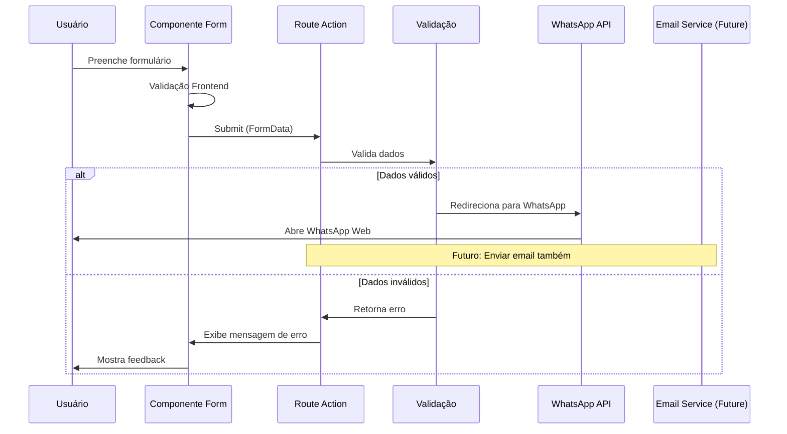
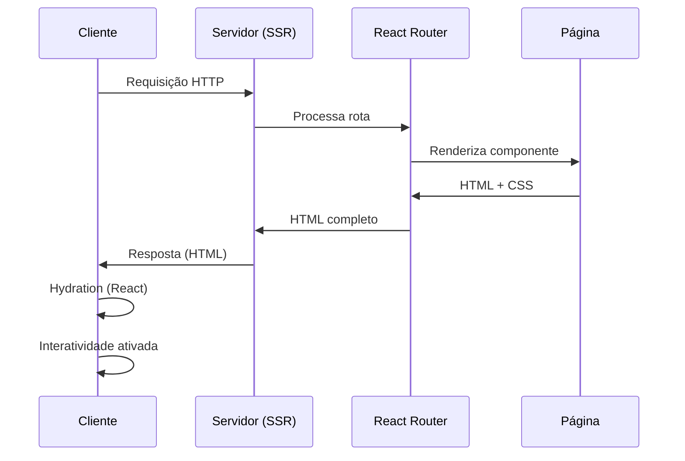
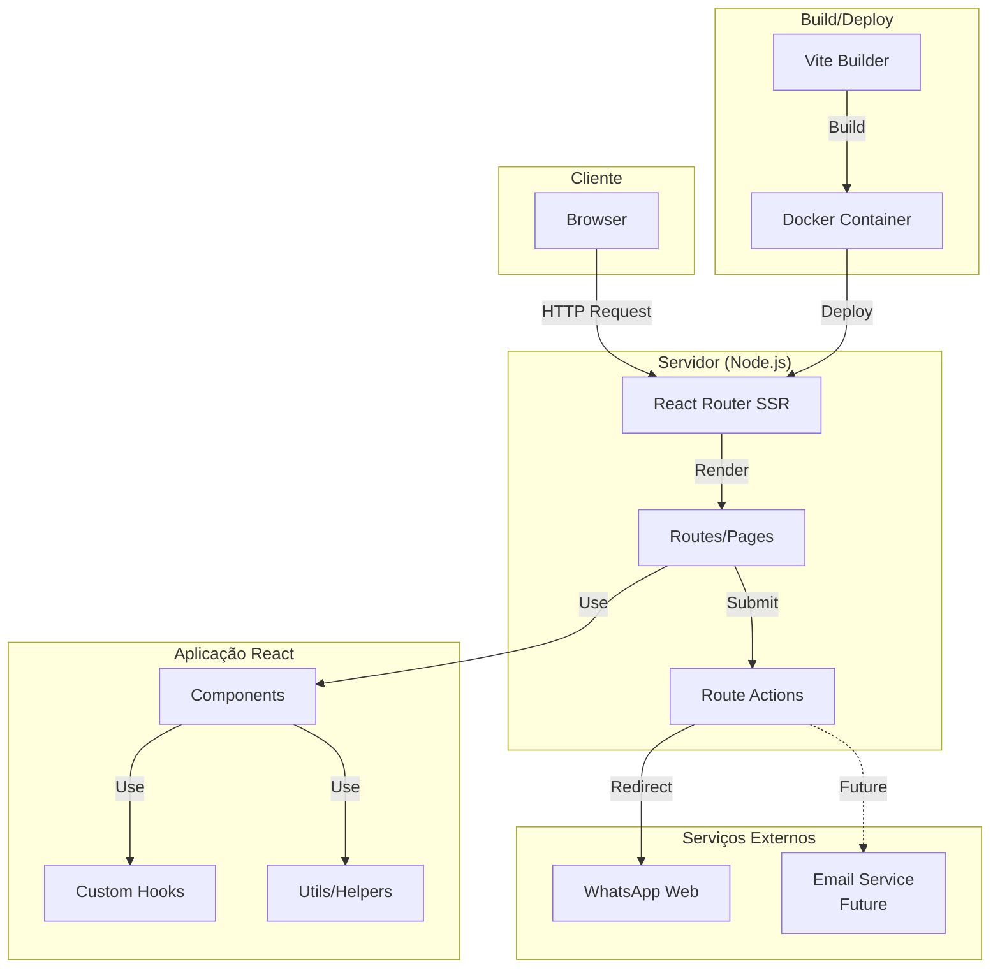
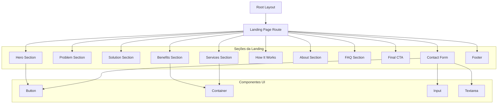
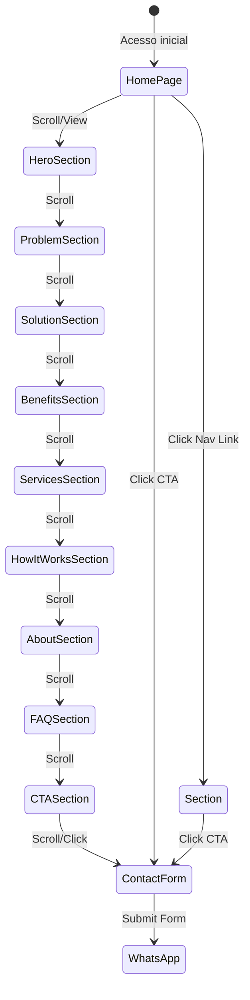
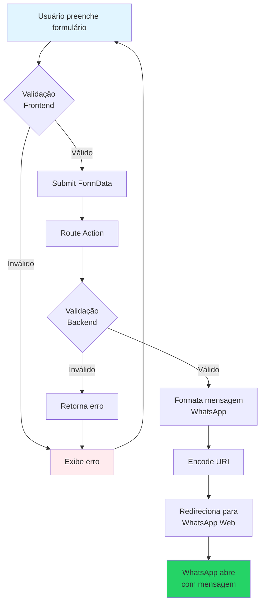

# Arquitetura - Landing Page iVebSystem

## 1. Visão Geral

Este documento descreve a arquitetura técnica da landing page da iVebSystem, traduzindo os requisitos de negócio do PRD em uma solução técnica coerente, escalável e alinhada ao sistema existente.

### Contexto do Projeto

O projeto já possui uma base estabelecida com:
- **Stack Principal**: React Router v7, React 19, TypeScript, TailwindCSS v4
- **Build Tool**: Vite 7
- **Renderização**: Server-Side Rendering (SSR) habilitado
- **Deploy**: Docker configurado para produção
- **Estrutura**: Landing page parcialmente implementada com componentes modulares

---

## 2. Análise da Arquitetura Existente

### 2.1 Stack Tecnológico Atual

```
┌─────────────────────────────────────────┐
│         Camada de Apresentação          │
├─────────────────────────────────────────┤
│ React 19 + React Router v7              │
│ TypeScript 5.9                          │
│ TailwindCSS v4                          │
└─────────────────────────────────────────┘
           │
           ▼
┌─────────────────────────────────────────┐
│         Camada de Build/Dev              │
├─────────────────────────────────────────┤
│ Vite 7                                  │
│ React Router Dev                        │
│ TypeScript Compiler                     │
└─────────────────────────────────────────┘
           │
           ▼
┌─────────────────────────────────────────┐
│         Camada de Deploy                 │
├─────────────────────────────────────────┤
│ Docker (Node 20 Alpine)                 │
│ React Router Serve                      │
└─────────────────────────────────────────┘
```

### 2.2 Estrutura de Diretórios Atual

```
ivebsystem/
├── app/
│   ├── components/          # Componentes reutilizáveis
│   │   ├── landing/         # Componentes específicos da landing
│   │   ├── layout/          # Componentes de layout
│   │   ├── navigation/      # Componentes de navegação
│   │   ├── forms/           # Componentes de formulário
│   │   └── ui/              # Componentes UI básicos
│   ├── routes/              # Rotas da aplicação
│   │   ├── landing.tsx      # Rota principal (já implementada)
│   │   └── marketing/       # Rotas de marketing
│   ├── hooks/               # Custom hooks
│   ├── root.tsx             # Root component e layout
│   ├── routes.ts            # Configuração de rotas
│   └── app.css              # Estilos globais
├── public/                  # Assets estáticos
├── build/                   # Build de produção
├── package.json
├── vite.config.ts
├── react-router.config.ts
├── tsconfig.json
└── Dockerfile
```

### 2.3 Padrões Identificados

**Pontos Fortes:**
- ✅ Estrutura modular com componentes separados por responsabilidade
- ✅ TypeScript para type safety
- ✅ SSR habilitado para SEO e performance
- ✅ TailwindCSS para estilização consistente
- ✅ Docker para deploy consistente

**Oportunidades de Melhoria:**
- ⚠️ Falta de camada de serviços/API para formulário
- ⚠️ Integração direta com WhatsApp (redirecionamento) - pode ser melhorada
- ⚠️ Ausência de validação de formulário no backend
- ⚠️ Falta de tratamento de erros estruturado
- ⚠️ Ausência de analytics/monitoramento

---

## 3. Arquitetura Alvo

### 3.1 Princípios Arquiteturais

1. **Simplicidade**: Manter arquitetura simples, evitando over-engineering
2. **Escalabilidade**: Estrutura que permita crescimento futuro sem refatoração massiva
3. **Manutenibilidade**: Código limpo, bem organizado e documentado
4. **Performance**: Otimização para Core Web Vitals e SEO
5. **Separação de Responsabilidades**: Componentes, lógica e dados bem separados

### 3.2 Arquitetura em Camadas

```
┌─────────────────────────────────────────────────────────────┐
│                    CAMADA DE APRESENTAÇÃO                    │
│  ┌──────────────┐  ┌──────────────┐  ┌──────────────┐     │
│  │   Routes     │  │  Components  │  │     UI        │     │
│  │  (Pages)     │  │  (Sections)  │  │  (Elements)   │     │
│  └──────────────┘  └──────────────┘  └──────────────┘     │
└─────────────────────────────────────────────────────────────┘
                            │
                            ▼
┌─────────────────────────────────────────────────────────────┐
│                    CAMADA DE LÓGICA                          │
│  ┌──────────────┐  ┌──────────────┐  ┌──────────────┐     │
│  │   Actions    │  │    Hooks     │  │   Utils      │     │
│  │  (Form/API)  │  │  (Custom)    │  │  (Helpers)   │     │
│  └──────────────┘  └──────────────┘  └──────────────┘     │
└─────────────────────────────────────────────────────────────┘
                            │
                            ▼
┌─────────────────────────────────────────────────────────────┐
│                    CAMADA DE SERVIÇOS                         │
│  ┌──────────────┐  ┌──────────────┐  ┌──────────────┐     │
│  │   Email      │  │  Validation  │  │   Analytics  │     │
│  │  Service     │  │   Service    │  │   (Future)   │     │
│  └──────────────┘  └──────────────┘  └──────────────┘     │
└─────────────────────────────────────────────────────────────┘
                            │
                            ▼
┌─────────────────────────────────────────────────────────────┐
│                    CAMADA DE DADOS                            │
│  ┌──────────────┐  ┌──────────────┐  ┌──────────────┐     │
│  │   Form Data  │  │   Metadata   │  │   Content    │     │
│  │  (Temporary) │  │   (SEO)      │  │  (Static)    │     │
│  └──────────────┘  └──────────────┘  └──────────────┘     │
└─────────────────────────────────────────────────────────────┘
```

### 3.3 Fluxo de Dados

#### 3.3.1 Fluxo de Formulário de Contato



#### 3.3.2 Fluxo de Renderização (SSR)



---

## 4. Decisões Arquiteturais

### 4.1 Decisão 1: Manter React Router v7 com SSR

**Contexto:**
O projeto já utiliza React Router v7 com SSR habilitado.

**Decisão:**
Manter React Router v7 com SSR para a landing page.

**Justificativa:**
- ✅ **SEO**: SSR é essencial para indexação adequada pelos motores de busca
- ✅ **Performance**: Primeira renderização no servidor reduz Time to First Byte (TTFB)
- ✅ **Experiência do Usuário**: Conteúdo visível imediatamente, sem esperar JavaScript
- ✅ **Já Implementado**: Não requer mudanças na stack existente
- ✅ **React Router v7**: Framework moderno, bem mantido, com excelente DX

**Alternativas Consideradas:**
- ❌ **SPA puro**: Pior SEO, pior performance inicial
- ❌ **Next.js**: Requer migração completa, overkill para landing page simples
- ❌ **Astro**: Boa opção, mas requer refatoração total

**Riscos:**
- Baixo: Stack já está funcionando
- Mitigação: Manter estrutura atual, apenas ajustar conforme PRD

---

### 4.2 Decisão 2: Arquitetura de Componentes Modular

**Contexto:**
Precisa-se organizar componentes conforme seções do PRD.

**Decisão:**
Manter estrutura modular existente, organizando por seções da landing page.

**Estrutura Proposta:**
```
app/components/
├── landing/
│   ├── hero-section.tsx           ✅ Já existe
│   ├── problem-section.tsx        ✅ Já existe
│   ├── solution-section.tsx        ✅ Já existe
│   ├── benefits-section.tsx        ⚠️ Criar (US-04)
│   ├── services-section.tsx        ⚠️ Criar (US-05)
│   ├── how-it-works-section.tsx   ✅ Já existe
│   ├── about-section.tsx           ⚠️ Criar (US-07)
│   ├── contact-form-section.tsx   ✅ Já existe
│   └── ...
├── ui/                             # Componentes reutilizáveis
│   ├── button.tsx
│   ├── container.tsx
│   └── ...
└── forms/
    └── contact-form.tsx
```

**Justificativa:**
- ✅ **Manutenibilidade**: Fácil localizar e modificar seções específicas
- ✅ **Reutilização**: Componentes UI podem ser reutilizados
- ✅ **Testabilidade**: Componentes isolados são mais fáceis de testar
- ✅ **Colaboração**: Múltiplos desenvolvedores podem trabalhar em paralelo
- ✅ **Já Implementado**: Estrutura similar já existe

**Padrão de Componente:**
```typescript
// Estrutura padrão de seção
export function SectionName() {
  return (
    <section id="section-id" className="...">
      <Container>
        {/* Conteúdo da seção */}
      </Container>
    </section>
  );
}
```

---

### 4.3 Decisão 3: Formulário de Contato - Integração Híbrida

**Contexto:**
PRD requer formulário funcional. Atualmente redireciona para WhatsApp.

**Decisão:**
Manter redirecionamento para WhatsApp como solução primária, com preparação para email futuro.

**Justificativa:**
- ✅ **Simplicidade**: Solução imediata sem backend complexo
- ✅ **Conversão Direta**: WhatsApp tem alta taxa de conversão no Brasil
- ✅ **Sem Infraestrutura**: Não requer servidor de email ou API
- ✅ **Custo Zero**: Sem custos adicionais de serviços
- ⚠️ **Limitação**: Não há backup/armazenamento de leads

**Estrutura Proposta:**
```typescript
// app/routes/landing.tsx
export async function action({ request }: Route.ActionArgs) {
  // 1. Validação de dados
  // 2. Formatação para WhatsApp
  // 3. Redirecionamento
  // 4. (Futuro) Envio de email paralelo
}
```

**Evolução Futura:**
- Fase 2: Adicionar serviço de email (EmailJS, Resend, ou backend próprio)
- Fase 3: Armazenar leads em banco de dados (se necessário)

**Alternativas Consideradas:**
- ❌ **Backend próprio**: Overkill para landing page, custo de infraestrutura
- ❌ **Formspree/outros**: Custo mensal, dependência externa
- ✅ **WhatsApp direto**: Solução imediata, alta conversão

---

### 4.4 Decisão 4: Validação de Formulário - Dupla Camada

**Contexto:**
PRD exige validação de formulários (frontend e backend).

**Decisão:**
Implementar validação no frontend (UX) e no backend/action (segurança).

**Estratégia:**
1. **Frontend**: Validação imediata com feedback visual (usando HTML5 + JavaScript)
2. **Backend (Action)**: Validação server-side antes de processar

**Justificativa:**
- ✅ **UX**: Feedback imediato ao usuário
- ✅ **Segurança**: Validação server-side previne bypass
- ✅ **Performance**: Evita requisições desnecessárias
- ✅ **Acessibilidade**: HTML5 validation funciona sem JS

**Implementação:**
```typescript
// Frontend: HTML5 + validação custom
<input 
  type="email" 
  required 
  pattern="[^@]+@[^@]+\.[^@]+"
  aria-invalid={hasError}
/>

// Backend: Validação na action
if (!email || !isValidEmail(email)) {
  return { error: "Email inválido" };
}
```

---

### 4.5 Decisão 5: SEO e Metadata - Estrutura Semântica

**Contexto:**
PRD exige SEO básico (meta tags, Open Graph, Schema.org).

**Decisão:**
Utilizar recursos nativos do React Router para metadata e adicionar Schema.org manualmente.

**Estrutura:**
```typescript
// app/routes/landing.tsx
export function meta({}: Route.MetaArgs) {
  return [
    { title: "iVebSystem - Tecnologia Sob Demanda" },
    { name: "description", content: "..." },
    // Open Graph
    { property: "og:title", content: "..." },
    { property: "og:description", content: "..." },
    { property: "og:type", content: "website" },
    // Twitter Card
    { name: "twitter:card", content: "summary_large_image" },
  ];
}
```

**Schema.org:**
Adicionar JSON-LD no componente para rich snippets.

**Justificativa:**
- ✅ **Nativo**: React Router gerencia metadata automaticamente
- ✅ **SSR**: Metadata renderizada no servidor (SEO-friendly)
- ✅ **Type-safe**: TypeScript garante tipos corretos
- ✅ **Flexível**: Fácil adicionar novos metadados

---

### 4.6 Decisão 6: Performance - Otimizações Essenciais

**Contexto:**
PRD exige Lighthouse Score > 80 e carregamento < 3s.

**Decisões de Otimização:**

1. **Imagens:**
   - Usar formato WebP com fallback
   - Lazy loading para imagens abaixo do fold
   - Otimização de tamanho (compressão)

2. **CSS/JS:**
   - Minificação automática (Vite)
   - Code splitting por rota (React Router)
   - Tree shaking (Vite)

3. **Fontes:**
   - Preload de fontes críticas
   - Usar `font-display: swap`
   - Considerar fontes do sistema como fallback

4. **Assets:**
   - CDN para assets estáticos (se aplicável)
   - Cache headers apropriados

**Justificativa:**
- ✅ **Core Web Vitals**: Impacta diretamente ranking no Google
- ✅ **Conversão**: Páginas rápidas convertem mais
- ✅ **Experiência**: Usuários esperam carregamento rápido
- ✅ **Ferramentas**: Vite já otimiza automaticamente

---

### 4.7 Decisão 7: Acessibilidade - WCAG AA Mínimo

**Contexto:**
PRD exige acessibilidade básica (contraste, navegação por teclado).

**Decisão:**
Implementar padrões WCAG AA como mínimo, com foco em:
- Contraste de cores adequado
- Navegação por teclado
- Textos alternativos em imagens
- Estrutura semântica HTML
- ARIA labels onde necessário

**Justificativa:**
- ✅ **Legal**: Conformidade com leis de acessibilidade
- ✅ **Ético**: Inclusão de todos os usuários
- ✅ **Negócio**: Maior alcance de público
- ✅ **SEO**: Boas práticas de acessibilidade ajudam SEO

**Implementação:**
- Usar elementos semânticos (`<header>`, `<main>`, `<section>`, `<nav>`)
- Adicionar `aria-label` em ícones e botões sem texto
- Garantir contraste mínimo de 4.5:1 para texto normal
- Testar navegação apenas com teclado

---

### 4.8 Decisão 8: Responsividade - Mobile-First

**Contexto:**
PRD exige design responsivo (mobile, tablet, desktop).

**Decisão:**
Adotar abordagem mobile-first com TailwindCSS breakpoints.

**Breakpoints:**
- Mobile: < 768px (padrão)
- Tablet: ≥ 768px (`md:`)
- Desktop: ≥ 1024px (`lg:`)
- Large Desktop: ≥ 1280px (`xl:`)

**Justificativa:**
- ✅ **Mobile-First**: Maioria do tráfego vem de mobile
- ✅ **TailwindCSS**: Já configurado, facilita responsividade
- ✅ **Performance**: Mobile-first força otimização
- ✅ **UX**: Experiência consistente em todos os dispositivos

---

## 5. Diagramas Arquiteturais

### 5.1 Arquitetura de Alto Nível



### 5.2 Estrutura de Componentes



### 5.3 Fluxo de Navegação



### 5.4 Fluxo de Dados do Formulário



---

## 6. Padrões e Convenções

### 6.1 Estrutura de Arquivos

```
app/
├── routes/
│   └── landing.tsx              # Rota principal, action do form
├── components/
│   ├── landing/                  # Componentes específicos da landing
│   │   ├── hero-section.tsx
│   │   ├── problem-section.tsx
│   │   └── ...
│   ├── ui/                       # Componentes UI reutilizáveis
│   │   ├── button.tsx
│   │   └── container.tsx
│   └── forms/
│       └── contact-form.tsx
├── hooks/                        # Custom hooks
│   └── use-form-validation.ts
├── utils/                        # Funções utilitárias
│   ├── validation.ts
│   └── formatting.ts
└── types/                        # TypeScript types
    └── form.ts
```

### 6.2 Convenções de Nomenclatura

- **Componentes**: PascalCase (`HeroSection.tsx`)
- **Hooks**: camelCase com prefixo `use` (`useFormValidation.ts`)
- **Utils**: camelCase (`formatPhoneNumber.ts`)
- **Types**: PascalCase (`FormData.ts`)
- **Rotas**: kebab-case na URL, PascalCase no arquivo (`landing.tsx` → `/`)

### 6.3 Padrões de Código

**Componentes:**
```typescript
// Estrutura padrão de componente de seção
export function SectionName() {
  return (
    <section id="section-id" className="py-20 bg-[#0a0e1a]">
      <Container>
        {/* Conteúdo */}
      </Container>
    </section>
  );
}
```

**Actions:**
```typescript
export async function action({ request }: Route.ActionArgs) {
  const formData = await request.formData();
  // Validação
  // Processamento
  // Resposta
}
```

**Meta Tags:**
```typescript
export function meta({}: Route.MetaArgs) {
  return [
    { title: "..." },
    { name: "description", content: "..." },
  ];
}
```

---

## 7. Riscos Técnicos e Mitigações

### 7.1 Risco: Performance em Dispositivos Móveis

**Descrição:**
Landing page com muitas seções pode ter performance ruim em dispositivos móveis antigos.

**Probabilidade:** Média  
**Impacto:** Alto

**Mitigação:**
- Lazy loading de imagens
- Code splitting por rota (já implementado)
- Otimização de CSS (Tailwind purging)
- Testes em dispositivos reais
- Monitoramento de Core Web Vitals

---

### 7.2 Risco: Integração de Formulário

**Descrição:**
Redirecionamento para WhatsApp pode não funcionar em todos os contextos (apps embutidos, bloqueadores).

**Probabilidade:** Baixa  
**Impacto:** Médio

**Mitigação:**
- Fallback para link direto se redirecionamento falhar
- Mensagem clara para usuário sobre o que acontecerá
- Considerar alternativa de email como backup futuro

---

### 7.3 Risco: SEO e Indexação

**Descrição:**
Conteúdo dinâmico ou JavaScript pesado pode impactar indexação.

**Probabilidade:** Baixa (SSR resolve)  
**Impacto:** Alto

**Mitigação:**
- SSR garante conteúdo no HTML inicial
- Meta tags corretas
- Schema.org para rich snippets
- Sitemap.xml
- Testes com Google Search Console

---

### 7.4 Risco: Manutenibilidade de Conteúdo

**Descrição:**
Conteúdo hardcoded nos componentes dificulta atualizações.

**Probabilidade:** Alta  
**Impacto:** Médio

**Mitigação:**
- Separar conteúdo em arquivos de configuração ou constantes
- Documentar onde cada conteúdo está localizado
- Considerar CMS headless no futuro se necessário

---

## 8. Evolução Futura

### 8.1 Fase 2: Melhorias de Formulário

- Adicionar serviço de email paralelo ao WhatsApp
- Armazenar leads em banco de dados (opcional)
- Dashboard de leads (se necessário)

### 8.2 Fase 3: Analytics e Monitoramento

- Google Analytics 4
- Hotjar ou similar para heatmaps
- Monitoramento de performance (Sentry, LogRocket)

### 8.3 Fase 4: Conteúdo Dinâmico

- CMS headless (Strapi, Contentful) se conteúdo mudar frequentemente
- Blog (se necessário)
- Portfólio dinâmico

### 8.4 Fase 5: Otimizações Avançadas

- PWA (Progressive Web App)
- Service Workers para cache
- A/B testing de CTAs

---

## 9. Dependências e Integrações

### 9.1 Dependências Principais

**Runtime:**
- `react`: ^19.2.3
- `react-dom`: ^19.2.3
- `react-router`: 7.10.1

**Build:**
- `vite`: ^7.1.7
- `@react-router/dev`: 7.10.1
- `typescript`: ^5.9.2

**Estilização:**
- `tailwindcss`: ^4.1.13
- `@tailwindcss/vite`: ^4.1.13

**UI:**
- `@iconify/react`: ^6.0.2

### 9.2 Integrações Externas

**Atuais:**
- WhatsApp Web API (redirecionamento)

**Futuras:**
- Serviço de email (EmailJS, Resend, ou backend próprio)
- Google Analytics (opcional)
- Google Search Console (configuração manual)

---

## 10. Considerações de Deploy

### 10.1 Ambiente de Produção

**Requisitos:**
- Node.js 20+
- Suporte a Docker (opcional)
- Domínio com HTTPS configurado
- Variáveis de ambiente (se necessário)

### 10.2 Build de Produção

```bash
npm run build
```

Gera:
- `build/client/` - Assets estáticos
- `build/server/` - Código do servidor SSR

### 10.3 Deploy

**Opções:**
1. **Docker**: Usar Dockerfile existente
2. **Node.js direto**: `npm run start`
3. **Plataformas**: Vercel, Netlify, Railway, Fly.io (compatíveis com React Router)

---

## 11. Métricas e Monitoramento

### 11.1 Métricas de Performance

- Lighthouse Score (meta: > 80)
- Core Web Vitals:
  - LCP (Largest Contentful Paint) < 2.5s
  - FID (First Input Delay) < 100ms
  - CLS (Cumulative Layout Shift) < 0.1

### 11.2 Métricas de Negócio (Futuro)

- Taxa de conversão do formulário
- Taxa de rejeição (bounce rate)
- Tempo médio na página
- Origem do tráfego

---

## 12. Conclusão

Esta arquitetura foi projetada para:

1. **Atender o PRD**: Todos os requisitos funcionais e não funcionais cobertos
2. **Aproveitar o existente**: Reutilizar estrutura e padrões já implementados
3. **Manter simplicidade**: Evitar over-engineering, focar no essencial
4. **Permitir evolução**: Estrutura preparada para crescimento futuro
5. **Garantir qualidade**: Performance, SEO, acessibilidade e manutenibilidade

A arquitetura é **coerente**, **escalável** e **alinhada** com o sistema atual, permitindo implementação eficiente da landing page conforme especificado no PRD.

---

**Versão:** 1.0  
**Data:** 2024  
**Autor:** Arquiteto de Software  
**Status:** Aprovado para Implementação

