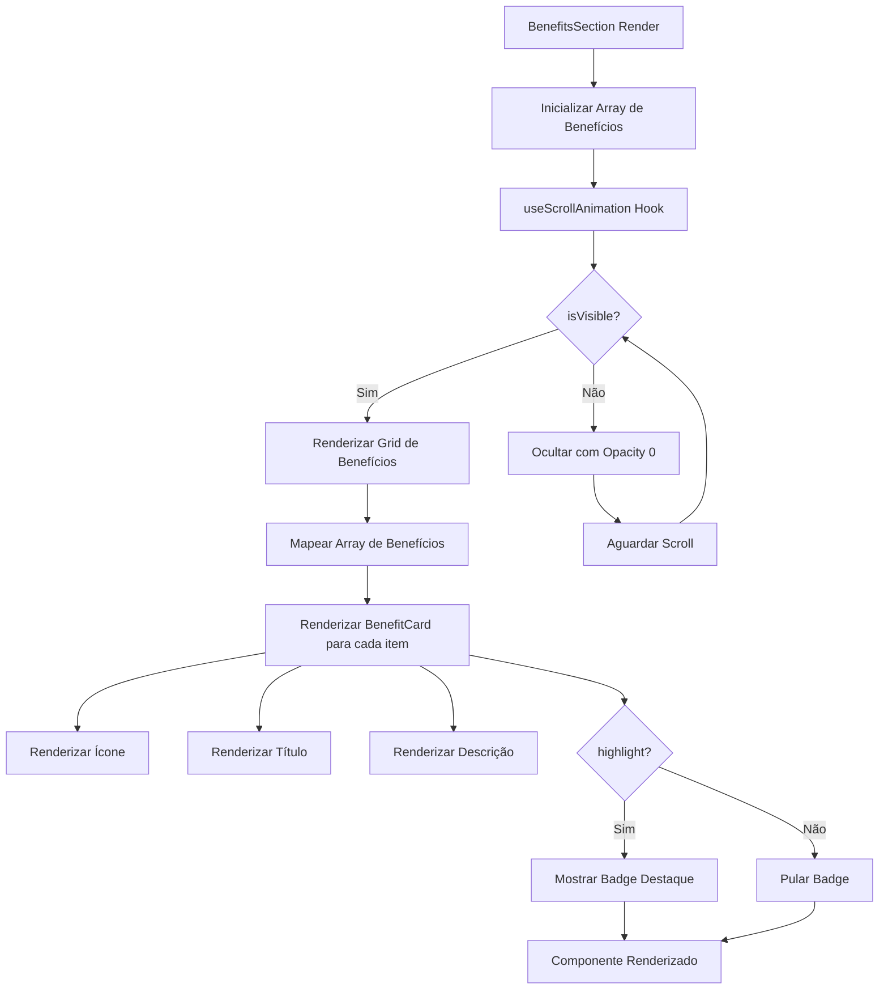
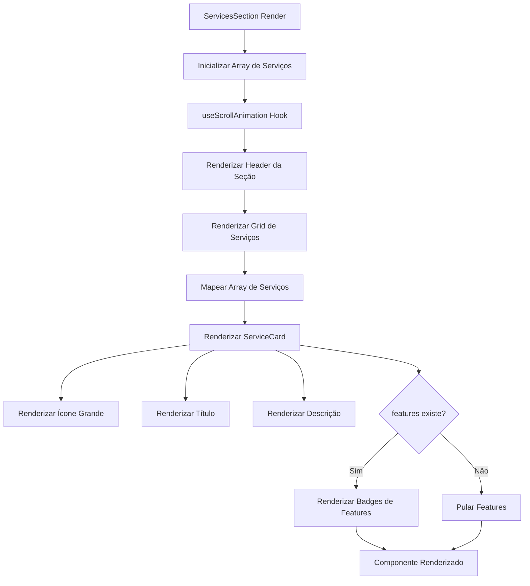
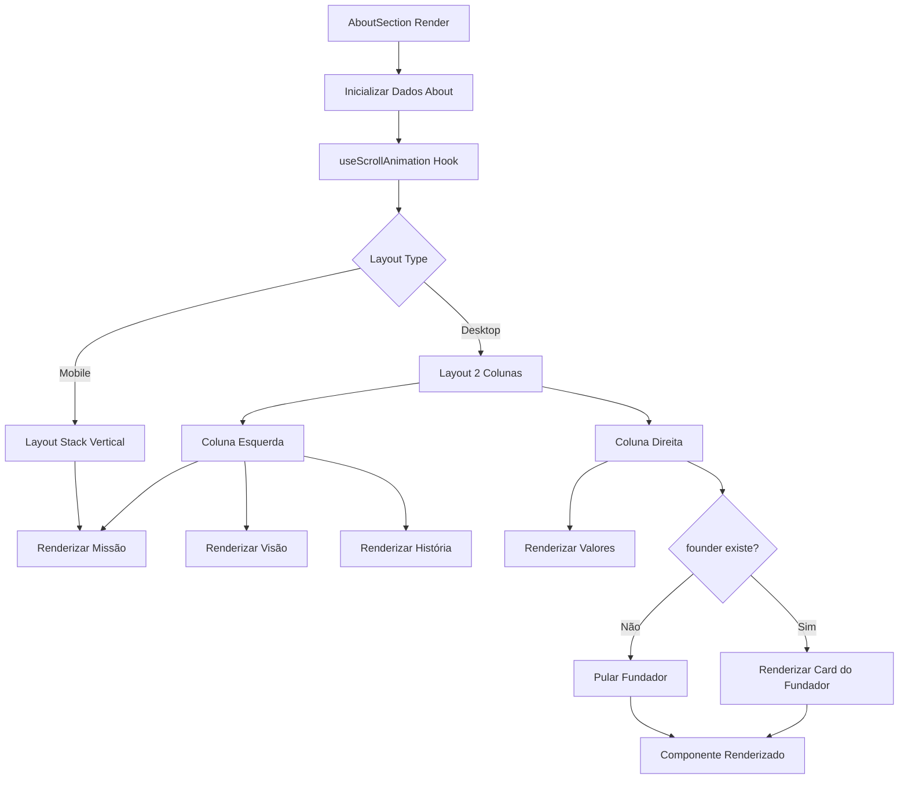
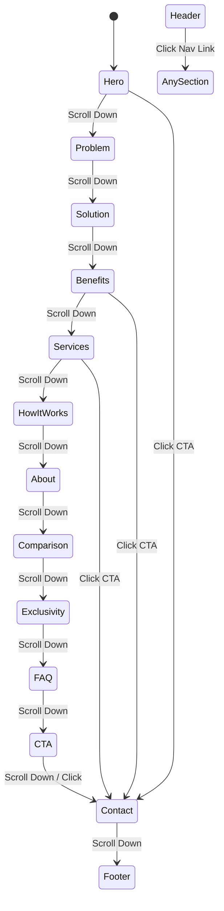
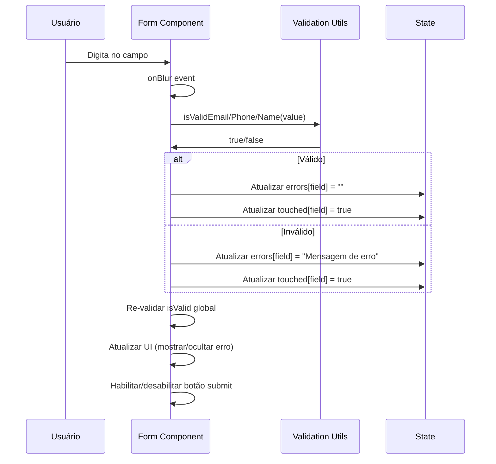
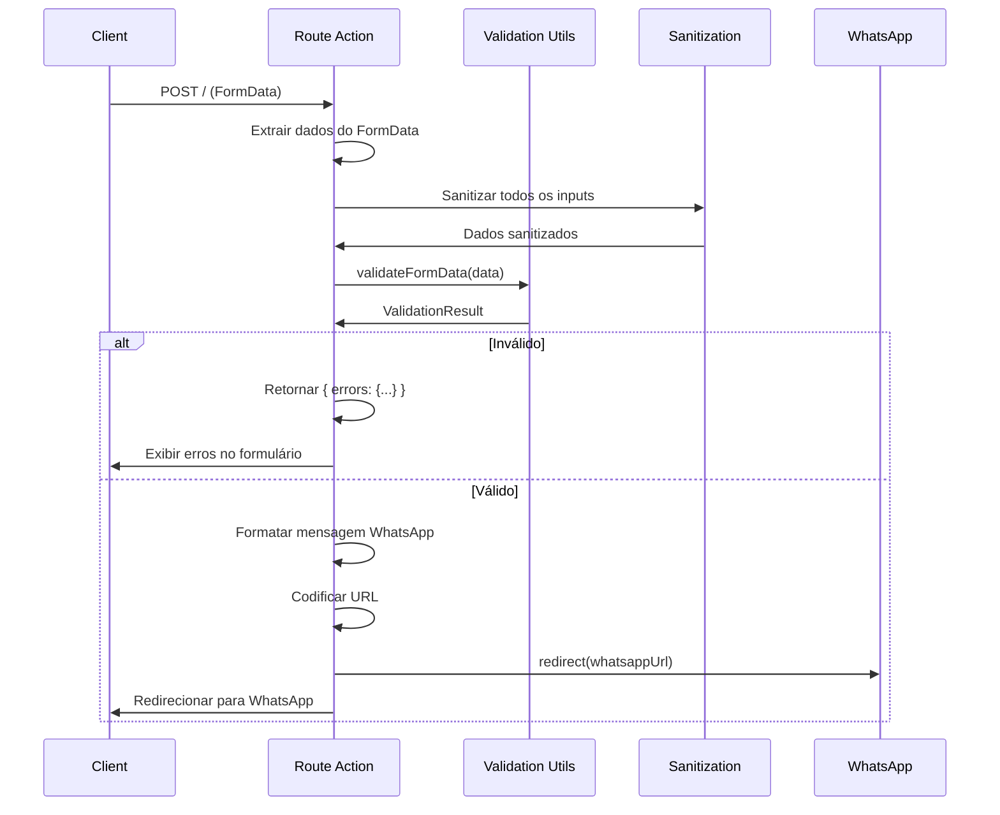
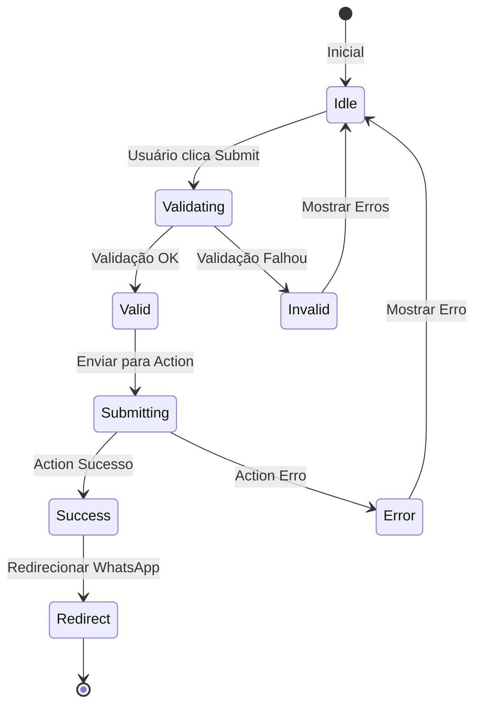
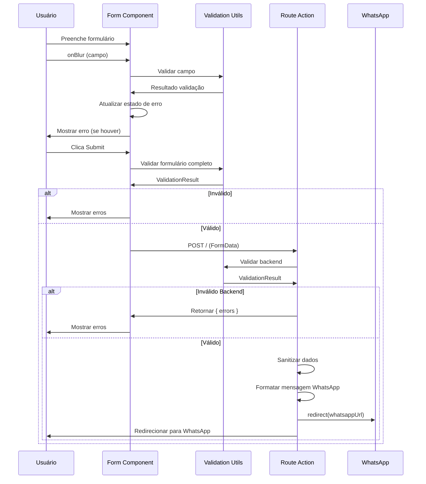
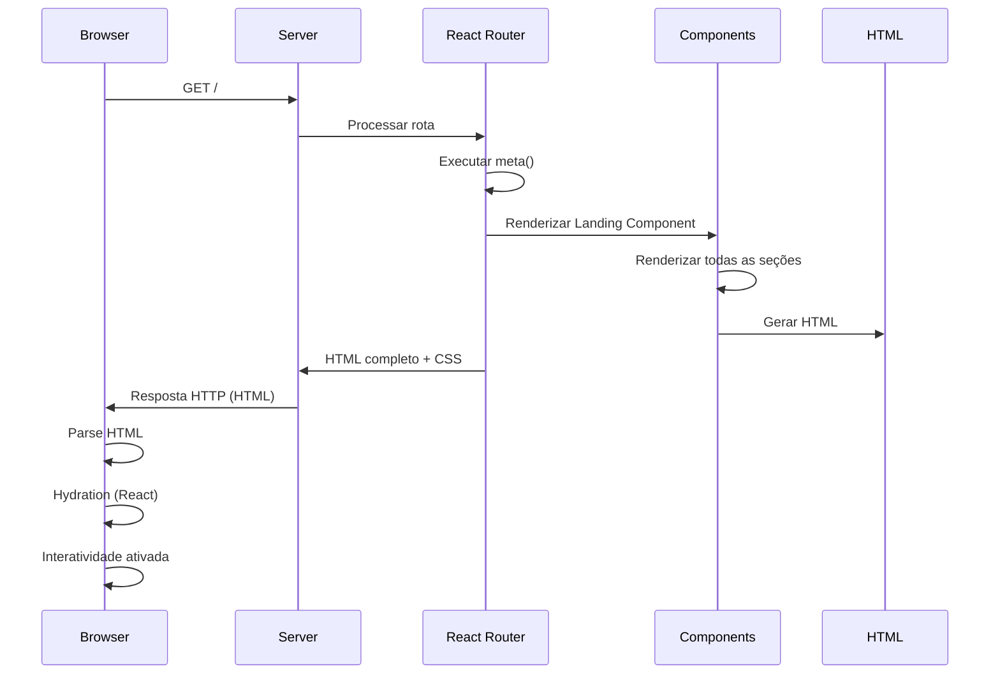

# Plano de Desenvolvimento Detalhado - Landing Page iVebSystem

## 1. Visão Geral

Este documento detalha **COMO** cada parte da solução será implementada tecnicamente, incluindo estruturas de dados, contratos, fluxos e lógica de implementação. Este é um documento de **planejamento técnico**, não de implementação.

### Princípios de Implementação

1. **Type Safety First**: TypeScript será usado rigorosamente para garantir type safety
2. **Component Composition**: Componentes serão compostos de forma modular e reutilizável
3. **Separation of Concerns**: Lógica de negócio separada de apresentação
4. **Progressive Enhancement**: Funcionalidades básicas funcionam sem JavaScript
5. **Accessibility by Default**: Acessibilidade considerada desde o início

---

## 2. ÉPICO 1: Componentes de Conteúdo Faltantes

### Task 1.1: BenefitsSection Component

#### Estrutura de Dados

**Tipo de Dados para Benefício:**
```typescript
interface Benefit {
  id: string;
  title: string;
  description: string;
  icon: string; // Nome do ícone do Iconify
  highlight?: boolean; // Se é um benefício destacado
}
```

**Array de Benefícios:**
```typescript
const benefits: Benefit[] = [
  {
    id: "no-investment",
    title: "Sem Alto Investimento Inicial",
    description: "Não precisa desembolsar R$ 50K+ de uma vez. Pagamento parcelado e acessível.",
    icon: "mdi:currency-usd-off",
    highlight: true
  },
  {
    id: "installments",
    title: "Pagamento Parcelado",
    description: "Divida o investimento em parcelas que cabem no seu orçamento mensal.",
    icon: "mdi:credit-card-multiple",
    highlight: true
  },
  {
    id: "guarantee",
    title: "Garantia de Entrega",
    description: "Contrato com garantia de entrega do software conforme especificado.",
    icon: "mdi:shield-check",
    highlight: true
  },
  {
    id: "partnership",
    title: "Parceria Contínua",
    description: "Não é apenas entrega. Parceria para manutenção, evolução e crescimento.",
    icon: "mdi:handshake",
    highlight: false
  },
  {
    id: "expansion",
    title: "Extensão e Comercialização",
    description: "Possibilidade de estender o projeto e comercializar para outras empresas do segmento.",
    icon: "mdi:chart-line",
    highlight: false
  }
];
```

#### Estrutura do Componente

**Props Interface:**
```typescript
interface BenefitsSectionProps {
  // Não requer props externas, mas pode receber para customização futura
  className?: string;
}
```

**Estrutura Visual:**
- Container principal com `Container` component
- Título da seção (h2) com animação de scroll
- Grid responsivo de benefícios:
  - Mobile: 1 coluna
  - Tablet: 2 colunas
  - Desktop: 3 colunas
- Cada card de benefício contém:
  - Ícone (Iconify) com cor temática
  - Título (h3)
  - Descrição (p)
  - Badge de "destaque" se `highlight: true`

#### Fluxo de Renderização



#### Lógica de Implementação

1. **Criação do Arquivo:**
   - Localização: `app/components/landing/benefits-section.tsx`
   - Exportar função `BenefitsSection` como default export

2. **Importações Necessárias:**
   - `Container` de `~/components`
   - `Icon` de `@iconify/react`
   - `useScrollAnimation` de `~/hooks/use-scroll-animation`
   - Tipos TypeScript (se necessário)

3. **Estrutura do JSX:**
   - `<section>` com id `benefits` ou `vantagens`
   - Classes Tailwind: `py-20 bg-[#0a0e1a]` (seguindo padrão existente)
   - Container interno com max-width
   - Grid de benefícios com `grid-cols-1 md:grid-cols-2 lg:grid-cols-3`

4. **Animações:**
   - Usar `useScrollAnimation` hook (já existe no projeto)
   - Aplicar classes condicionais baseadas em `isVisible`
   - Transições suaves com `transition-all duration-1000`

5. **Responsividade:**
   - Mobile-first approach
   - Breakpoints: `md:` (768px), `lg:` (1024px)
   - Espaçamento adaptativo

6. **Exportação:**
   - Adicionar export em `app/components/index.ts`
   - Importar na rota `app/routes/landing.tsx`

---

### Task 1.2: ServicesSection Component

#### Estrutura de Dados

**Tipo de Dados para Serviço:**
```typescript
interface Service {
  id: string;
  title: string;
  description: string;
  icon: string;
  features?: string[]; // Lista de características do serviço
}
```

**Array de Serviços:**
```typescript
const services: Service[] = [
  {
    id: "web-systems",
    title: "Sistemas Web Personalizados",
    description: "Desenvolvimento de sistemas web sob medida para suas necessidades específicas.",
    icon: "mdi:web",
    features: ["Responsivo", "Escalável", "Seguro"]
  },
  {
    id: "mobile-apps",
    title: "Aplicativos Mobile",
    description: "Apps nativos ou híbridos para iOS e Android.",
    icon: "mdi:cellphone",
    features: ["iOS", "Android", "Cross-platform"]
  },
  {
    id: "automation",
    title: "Automação de Processos",
    description: "Automatize processos repetitivos e ganhe eficiência operacional.",
    icon: "mdi:robot",
    features: ["RPA", "Workflows", "Integrações"]
  },
  {
    id: "integrations",
    title: "Integrações de Sistemas",
    description: "Conecte seus sistemas existentes e crie um ecossistema integrado.",
    icon: "mdi:api",
    features: ["APIs", "Webhooks", "ETL"]
  },
  {
    id: "consulting",
    title: "Consultoria Tecnológica",
    description: "Orientações estratégicas para transformação digital do seu negócio.",
    icon: "mdi:lightbulb-on",
    features: ["Estratégia", "Arquitetura", "Best Practices"]
  }
];
```

#### Estrutura do Componente

**Layout Visual:**
- Seção com título e descrição introdutória
- Grid de cards de serviços:
  - Mobile: 1 coluna
  - Tablet: 2 colunas
  - Desktop: 3 colunas
- Cada card contém:
  - Ícone grande e destacado
  - Título
  - Descrição
  - Lista de features (opcional, como badges)

#### Fluxo de Renderização



#### Lógica de Implementação

1. **Estrutura Similar a BenefitsSection:**
   - Mesmo padrão de arquivo e organização
   - Mesmas importações base
   - Mesmo hook de animação

2. **Diferenças Principais:**
   - Cards maiores (mais espaço para descrição)
   - Ícones maiores e mais destacados
   - Possibilidade de features como badges

3. **Design:**
   - Cards com hover effect (elevação sutil)
   - Gradientes sutis nos ícones
   - Espaçamento generoso

---

### Task 1.3: AboutSection Component

#### Estrutura de Dados

**Tipo de Dados para Sobre:**
```typescript
interface AboutData {
  companyName: string;
  tagline?: string;
  mission: string;
  vision?: string;
  values: string[];
  founder?: {
    name: string;
    role: string;
    bio?: string;
    image?: string;
  };
  history?: string; // Breve história da empresa
}
```

**Dados de Exemplo:**
```typescript
const aboutData: AboutData = {
  companyName: "iVebSystem",
  tagline: "Tecnologia sob demanda, parceria de longo prazo",
  mission: "Democratizar o acesso a soluções tecnológicas personalizadas, permitindo que empresas de todos os tamanhos transformem suas ideias em realidade sem alto investimento inicial.",
  vision: "Ser a principal referência em desenvolvimento de software sob demanda no Brasil, conhecida por parcerias duradouras e resultados excepcionais.",
  values: [
    "Transparência",
    "Comprometimento",
    "Inovação",
    "Parceria",
    "Qualidade"
  ],
  founder: {
    name: "[Nome do Fundador]",
    role: "Fundador & CEO",
    bio: "[Biografia breve]",
    image: "/images/founder.jpg" // Se disponível
  },
  history: "A iVebSystem nasceu da necessidade de oferecer soluções tecnológicas acessíveis para empresas que não podem investir grandes quantias inicialmente..."
};
```

#### Estrutura do Componente

**Layout Visual:**
- Seção dividida em duas colunas (desktop):
  - Coluna esquerda: Missão, Visão, História
  - Coluna direita: Valores, Fundador (se disponível)
- Mobile: Stack vertical
- Imagem do fundador (se disponível) com formato circular

#### Fluxo de Renderização



#### Lógica de Implementação

1. **Flexibilidade de Conteúdo:**
   - Componente deve funcionar mesmo sem todos os dados
   - Validações condicionais para campos opcionais
   - Placeholder text se dados não disponíveis

2. **Design:**
   - Tipografia hierárquica clara
   - Espaçamento generoso
   - Imagem do fundador com border-radius circular
   - Valores como lista ou badges

3. **Responsividade:**
   - Desktop: 2 colunas lado a lado
   - Tablet: 2 colunas empilhadas
   - Mobile: 1 coluna

---

### Task 1.4: Ajustar Ordem e Navegação

#### Estrutura de Ordem Final

**Ordem das Seções na Landing Page:**
```typescript
const sectionOrder = [
  "HeroSection",           // Hero
  "ProblemSection",         // Problema
  "SolutionSection",       // Solução
  "BenefitsSection",       // Benefícios (NOVO)
  "ServicesSection",       // Serviços (NOVO)
  "HowItWorksSection",     // Como Funciona
  "AboutSection",          // Sobre (NOVO)
  "ComparisonSection",      // Comparação (se mantiver)
  "ExclusivitySection",    // Exclusividade
  "FAQSection",            // FAQ
  "FinalCTASection",       // CTA Final
  "ContactFormSection",    // Formulário
  "LandingFooter"          // Footer
];
```

#### IDs e Anchors

**Mapeamento de IDs para Navegação:**
```typescript
const sectionIds = {
  hero: "hero",
  problem: "problema",
  solution: "solucao",
  benefits: "vantagens",      // NOVO
  services: "servicos",       // NOVO
  howItWorks: "como-funciona",
  about: "sobre",             // NOVO
  comparison: "comparacao",
  exclusivity: "exclusividade",
  faq: "faq",
  cta: "cta",
  contact: "formulario",
  footer: "footer"
};
```

#### Atualização do Header

**Links de Navegação Atualizados:**
- Manter links existentes
- Adicionar links para novas seções (se necessário)
- Atualizar scroll handlers

#### Fluxo de Navegação



#### Lógica de Implementação

1. **Reordenação em `landing.tsx`:**
   - Reordenar imports dos componentes
   - Reordenar renderização no JSX
   - Manter ordem lógica de fluxo

2. **Atualização de IDs:**
   - Adicionar `id` props nas novas seções
   - Garantir que IDs sejam únicos
   - Atualizar scroll handlers se necessário

3. **Navegação do Header:**
   - Revisar links existentes
   - Adicionar novos links se necessário
   - Testar scroll suave para todas as seções

---

## 3. ÉPICO 2: Validação e Melhorias de Formulário

### Task 2.1: Utilitários de Validação

#### Estrutura de Dados

**Tipo de Erro de Validação:**
```typescript
interface ValidationError {
  field: string;
  message: string;
}
```

**Resultado de Validação:**
```typescript
interface ValidationResult {
  valid: boolean;
  errors: Record<string, string>; // field -> error message
}
```

**Dados do Formulário:**
```typescript
interface FormData {
  name: string;
  email: string;
  phone: string;
  company?: string;
  message?: string;
}
```

#### Contratos de Funções

**1. `isValidEmail(email: string): boolean`**

**Lógica:**
- Regex pattern para validação de email
- Verificar formato básico: `user@domain.tld`
- Verificar comprimento mínimo e máximo
- Retornar `true` se válido, `false` caso contrário

**Regex Pattern:**
```
/^[^\s@]+@[^\s@]+\.[^\s@]+$/
```

**Validações Adicionais:**
- Email não pode ser vazio
- Comprimento máximo: 254 caracteres (RFC 5321)
- Comprimento mínimo: 5 caracteres (ex: a@b.c)

---

**2. `isValidPhone(phone: string): boolean`**

**Lógica:**
- Aceitar formatos brasileiros:
  - `(11) 99999-9999`
  - `11 99999-9999`
  - `11999999999`
  - `+55 11 99999-9999`
- Remover caracteres não numéricos
- Verificar se tem 10 ou 11 dígitos (com DDD)
- Verificar se DDD é válido (11-99)

**Regex Pattern:**
```
/^(\+55\s?)?(\(?\d{2}\)?\s?)?(\d{4,5}[-.\s]?\d{4})$/
```

**Validações:**
- Mínimo: 10 dígitos (fixo)
- Máximo: 13 dígitos (com código do país)
- DDD entre 11 e 99

---

**3. `sanitizeInput(input: string): string`**

**Lógica:**
- Remover caracteres perigosos para XSS
- Trim whitespace no início e fim
- Normalizar espaços múltiplos
- Escapar caracteres HTML se necessário

**Sanitizações:**
- Remover `<script>`, `</script>`, `javascript:`, `onerror=`, etc.
- Trim whitespace
- Normalizar quebras de linha
- Limitar comprimento (prevenir DoS)

---

**4. `validateFormData(data: FormData): ValidationResult`**

**Lógica:**
- Validar cada campo individualmente
- Acumular erros em objeto
- Retornar resultado consolidado

**Validações por Campo:**

**Nome:**
- Obrigatório
- Mínimo: 2 caracteres
- Máximo: 100 caracteres
- Apenas letras, espaços e caracteres acentuados

**Email:**
- Obrigatório
- Usar `isValidEmail()`

**Telefone:**
- Obrigatório
- Usar `isValidPhone()`

**Empresa:**
- Opcional
- Se preenchido: mínimo 2, máximo 100 caracteres

**Mensagem:**
- Opcional
- Se preenchido: máximo 2000 caracteres

#### Fluxo de Validação

```mermaid
flowchart TD
    Start[validateFormData] --> Extract[Extrair Dados do FormData]
    Extract --> Init[Inicializar errors: {}]
    Init --> ValidateName[Validar Nome]
    ValidateName --> NameValid{Nome válido?}
    NameValid -->|Não| AddNameError[Adicionar erro nome]
    NameValid -->|Sim| ValidateEmail[Validar Email]
    AddNameError --> ValidateEmail
    ValidateEmail --> EmailValid{Email válido?}
    EmailValid -->|Não| AddEmailError[Adicionar erro email]
    EmailValid -->|Sim| ValidatePhone[Validar Telefone]
    AddEmailError --> ValidatePhone
    ValidatePhone --> PhoneValid{Telefone válido?}
    PhoneValid -->|Não| AddPhoneError[Adicionar erro telefone]
    PhoneValid -->|Sim| ValidateCompany[Validar Empresa]
    AddPhoneError --> ValidateCompany
    ValidateCompany --> CompanyValid{Empresa válida?}
    CompanyValid -->|Não| AddCompanyError[Adicionar erro empresa]
    CompanyValid -->|Sim| ValidateMessage[Validar Mensagem]
    AddCompanyError --> ValidateMessage
    ValidateMessage --> MessageValid{Mensagem válida?}
    MessageValid -->|Não| AddMessageError[Adicionar erro mensagem]
    MessageValid -->|Sim| CheckErrors[Verificar se há erros]
    AddMessageError --> CheckErrors
    CheckErrors --> HasErrors{errors.length > 0?}
    HasErrors -->|Sim| ReturnInvalid[Retornar {valid: false, errors}]
    HasErrors -->|Não| ReturnValid[Retornar {valid: true, errors: {}}]
    ReturnInvalid --> End
    ReturnValid --> End
```

#### Estrutura do Arquivo

**Localização:** `app/utils/validation.ts`

**Exports:**
```typescript
export function isValidEmail(email: string): boolean;
export function isValidPhone(phone: string): boolean;
export function sanitizeInput(input: string): string;
export function validateFormData(data: FormData): ValidationResult;
```

**JSDoc Comments:**
- Documentar cada função
- Exemplos de uso
- Parâmetros e retornos

---

### Task 2.2: Validação Frontend no Formulário

#### Estado do Componente

**Estado de Validação:**
```typescript
interface FormValidationState {
  errors: Record<string, string>; // field -> error message
  touched: Record<string, boolean>; // field -> foi tocado?
  isValid: boolean; // Formulário válido globalmente
}
```

**Estado de Loading:**
```typescript
interface FormState {
  isSubmitting: boolean;
  validation: FormValidationState;
}
```

#### Fluxo de Validação Frontend



#### Lógica de Implementação

1. **Importações:**
   - Importar funções de validação de `~/utils/validation`
   - Usar hooks do React (`useState`, `useCallback`)

2. **Estado Inicial:**
   ```typescript
   const [validation, setValidation] = useState<FormValidationState>({
     errors: {},
     touched: {},
     isValid: false
   });
   ```

3. **Handlers de Validação:**
   - `handleBlur`: Validar campo ao perder foco
   - `handleChange`: Opcionalmente validar durante digitação
   - `validateField`: Função reutilizável para validar um campo

4. **Validação em Tempo Real:**
   - `onBlur` em cada campo
   - Validar apenas campos `touched`
   - Mostrar erro apenas se `touched[field] && errors[field]`

5. **Feedback Visual:**
   - Borda vermelha se campo inválido e touched
   - Mensagem de erro abaixo do campo
   - Ícone de erro (opcional)
   - Botão submit desabilitado se `!isValid`

6. **Atributos HTML5:**
   - `required` nos campos obrigatórios
   - `type="email"` no campo email
   - `type="tel"` no campo telefone
   - `pattern` se necessário
   - `aria-invalid={!!errors[field]}`
   - `aria-describedby` apontando para mensagem de erro

#### Estrutura de Mensagens de Erro

**Mensagens Padronizadas:**
```typescript
const errorMessages = {
  name: {
    required: "Nome é obrigatório",
    minLength: "Nome deve ter pelo menos 2 caracteres",
    maxLength: "Nome deve ter no máximo 100 caracteres",
    invalid: "Nome contém caracteres inválidos"
  },
  email: {
    required: "Email é obrigatório",
    invalid: "Email inválido"
  },
  phone: {
    required: "Telefone é obrigatório",
    invalid: "Telefone inválido. Use formato: (11) 99999-9999"
  },
  company: {
    minLength: "Nome da empresa deve ter pelo menos 2 caracteres",
    maxLength: "Nome da empresa deve ter no máximo 100 caracteres"
  },
  message: {
    maxLength: "Mensagem deve ter no máximo 2000 caracteres"
  }
};
```

---

### Task 2.3: Melhorar Validação Backend na Action

#### Estrutura da Action

**Tipo de Retorno da Action:**
```typescript
type ActionResponse = 
  | { error: string }                    // Erro geral
  | { errors: Record<string, string> }   // Erros por campo
  | Response;                            // Redirect (WhatsApp)
```

#### Fluxo de Validação Backend



#### Lógica de Implementação

1. **Importações:**
   - Importar funções de validação
   - Importar `redirect` do React Router

2. **Extração de Dados:**
   ```typescript
   const formData = await request.formData();
   const name = sanitizeInput(formData.get("name") as string);
   const email = sanitizeInput(formData.get("email") as string);
   // ... outros campos
   ```

3. **Validação:**
   - Criar FormData objeto para validação
   - Chamar `validateFormData()`
   - Verificar `result.valid`

4. **Tratamento de Erros:**
   - Se inválido: retornar `{ errors: result.errors }`
   - Se válido: continuar com processamento

5. **Sanitização:**
   - Sanitizar TODOS os inputs antes de usar
   - Prevenir XSS e injection

6. **Formatação WhatsApp:**
   - Manter lógica existente
   - Usar dados sanitizados
   - Codificar URL corretamente

7. **Logging (Opcional):**
   - Log de erros de validação (sem dados sensíveis)
   - Log de sucesso (sem dados sensíveis)

---

### Task 2.4: Melhorar UX do Formulário

#### Estados Adicionais

**Estado de Loading:**
```typescript
const isSubmitting = navigation.state === "submitting";
```

**Estado de Feedback:**
```typescript
interface FeedbackState {
  type: "success" | "error" | null;
  message: string;
}
```

#### Melhorias de UX

1. **Loading State:**
   - Desabilitar formulário durante submit
   - Mostrar spinner no botão
   - Texto "Enviando..." no botão
   - Prevenir múltiplos submits

2. **Feedback Visual:**
   - Mensagem de sucesso (antes do redirect)
   - Mensagem de erro mais destacada
   - Animações suaves de transição

3. **Acessibilidade:**
   - `aria-label` em campos sem label visível
   - `aria-describedby` apontando para descrição/erro
   - `aria-live="polite"` para mensagens dinâmicas
   - `aria-busy="true"` durante submit
   - `role="alert"` em mensagens de erro

4. **Navegação por Teclado:**
   - Tab order lógico
   - Foco visível (outline)
   - Enter para submit
   - Escape para limpar (opcional)

5. **Contraste:**
   - Verificar contraste de cores
   - Mensagens de erro com contraste adequado
   - Botões com contraste adequado

#### Fluxo de Submit



---

## 4. ÉPICO 3: SEO e Metadata

### Task 3.1: Completar Meta Tags

#### Estrutura de Metadata

**Tipo de Meta Tag:**
```typescript
interface MetaTag {
  title?: string;
  name?: string;
  property?: string;
  content: string;
}
```

**Metadata Completo:**
```typescript
const metadata = {
  title: "iVebSystem - Tecnologia Sob Demanda | Desenvolvimento de Software",
  description: "Desenvolvemos software sob demanda com custo mensal previsível, sem alto investimento inicial. Parceria contínua, garantia de entrega e possibilidade de expansão.",
  keywords: "desenvolvimento de software, tecnologia sob demanda, software sob medida, desenvolvimento web, aplicativos mobile",
  og: {
    title: "iVebSystem - Tecnologia Sob Demanda",
    description: "Desenvolvemos software sob demanda com custo mensal previsível...",
    type: "website",
    url: "https://ivebsystem.com.br",
    image: "https://ivebsystem.com.br/og-image.jpg"
  },
  twitter: {
    card: "summary_large_image",
    title: "iVebSystem - Tecnologia Sob Demanda",
    description: "Desenvolvemos software sob demanda...",
    image: "https://ivebsystem.com.br/twitter-image.jpg"
  },
  canonical: "https://ivebsystem.com.br"
};
```

#### Implementação na Rota

**Função `meta()` Expandida:**
```typescript
export function meta({}: Route.MetaArgs) {
  return [
    { title: metadata.title },
    { name: "description", content: metadata.description },
    { name: "keywords", content: metadata.keywords },
    // Open Graph
    { property: "og:title", content: metadata.og.title },
    { property: "og:description", content: metadata.og.description },
    { property: "og:type", content: metadata.og.type },
    { property: "og:url", content: metadata.og.url },
    { property: "og:image", content: metadata.og.image },
    // Twitter Card
    { name: "twitter:card", content: metadata.twitter.card },
    { name: "twitter:title", content: metadata.twitter.title },
    { name: "twitter:description", content: metadata.twitter.description },
    { name: "twitter:image", content: metadata.twitter.image },
    // Canonical
    { rel: "canonical", href: metadata.canonical }
  ];
}
```

---

### Task 3.2: Schema.org (JSON-LD)

#### Estrutura do Schema

**Tipo Organization:**
```typescript
interface OrganizationSchema {
  "@context": "https://schema.org";
  "@type": "Organization";
  name: string;
  description: string;
  url: string;
  logo?: string;
  contactPoint: {
    "@type": "ContactPoint";
    telephone: string;
    contactType: "customer service";
    email?: string;
  };
  sameAs?: string[]; // Redes sociais
}
```

**Dados do Schema:**
```typescript
const organizationSchema: OrganizationSchema = {
  "@context": "https://schema.org",
  "@type": "Organization",
  name: "iVebSystem",
  description: "Desenvolvimento de software sob demanda...",
  url: "https://ivebsystem.com.br",
  logo: "https://ivebsystem.com.br/logo.png",
  contactPoint: {
    "@type": "ContactPoint",
    telephone: "+55-86-98130-4658",
    contactType: "customer service",
    email: "contato@ivebsystem.com.br"
  },
  sameAs: [
    "https://linkedin.com/company/ivebsystem",
    "https://instagram.com/ivebsystem"
  ]
};
```

#### Implementação

**Componente ou Função:**
- Criar função que retorna JSON-LD string
- Inserir no componente da landing page
- Usar `<script type="application/ld+json">` tag

**Localização:**
- Pode ser função em `app/utils/schema.ts`
- Ou componente `SchemaOrg` em `app/components`

---

### Task 3.3: Sitemap.xml

#### Estrutura do Sitemap

**XML Structure:**
```xml
<?xml version="1.0" encoding="UTF-8"?>
<urlset xmlns="http://www.sitemaps.org/schemas/sitemap/0.9">
  <url>
    <loc>https://ivebsystem.com.br/</loc>
    <lastmod>2024-01-01</lastmod>
    <changefreq>monthly</changefreq>
    <priority>1.0</priority>
  </url>
</urlset>
```

**Localização:** `public/sitemap.xml`

**Atualização:**
- Atualizar `lastmod` manualmente ou via script
- Manter formato XML válido

---

### Task 3.4: Estrutura Semântica HTML

#### Checklist de Semântica

1. **Elementos Semânticos:**
   - `<header>` para cabeçalho
   - `<main>` para conteúdo principal
   - `<section>` para cada seção
   - `<nav>` para navegação
   - `<footer>` para rodapé
   - `<article>` se aplicável

2. **Headings Hierárquicos:**
   - Um único `<h1>` na página (Hero)
   - `<h2>` para títulos de seções
   - `<h3>` para subtítulos
   - Não pular níveis (h1 -> h3)

3. **Imagens:**
   - Todas com `alt` text descritivo
   - `alt=""` apenas para imagens decorativas
   - `loading="lazy"` para imagens abaixo do fold

4. **Links:**
   - Texto descritivo (não "clique aqui")
   - `aria-label` se necessário

---

## 5. ÉPICO 4: Performance e Otimizações

### Task 4.1: Otimizar Imagens

#### Estratégia de Otimização

1. **Formatos:**
   - WebP como formato principal
   - Fallback para PNG/JPG
   - Usar `<picture>` element se necessário

2. **Lazy Loading:**
   - `loading="lazy"` em imagens abaixo do fold
   - Não lazy load em hero/above fold

3. **Dimensões:**
   - `width` e `height` explícitos
   - Prevenir layout shift (CLS)

4. **Compressão:**
   - Comprimir antes de adicionar ao projeto
   - Ferramentas: ImageOptim, Squoosh, etc.

#### Implementação

**Estrutura de Imagem Otimizada:**
```html

```

---

### Task 4.2: Otimizar Fontes

#### Estratégia

1. **Preconnect:**
   - Já existe no `root.tsx`
   - Manter para Google Fonts

2. **Font Display:**
   - Adicionar `font-display: swap` no CSS
   - Prevenir FOIT (Flash of Invisible Text)

3. **Fallback:**
   - Usar fontes do sistema como fallback
   - Ex: `font-family: 'Outfit', system-ui, sans-serif;`

---

### Task 4.3: Code Splitting

#### Verificação

1. **React Router:**
   - Já faz code splitting automático por rota
   - Verificar se está funcionando

2. **Lazy Loading de Componentes:**
   - Considerar `React.lazy()` se componentes muito pesados
   - Não necessário para landing page simples

3. **Chunks:**
   - Verificar tamanho dos chunks no build
   - Ideal: < 200KB por chunk

---

### Task 4.4: CSS Purging (Tailwind)

#### Verificação

1. **Configuração:**
   - Tailwind v4 já faz purging automático
   - Verificar `content` paths no config

2. **Build de Produção:**
   - Verificar tamanho do CSS final
   - Deve ser < 50KB (gzipped)

---

### Task 4.5: Teste de Performance Completo

#### Métricas a Atingir

1. **Lighthouse Score:**
   - Performance: > 80
   - Accessibility: > 90
   - Best Practices: > 90
   - SEO: > 90

2. **Core Web Vitals:**
   - LCP: < 2.5s
   - FID: < 100ms
   - CLS: < 0.1

3. **Tempo de Carregamento:**
   - < 3 segundos (conexão 3G)

---

## 6. ÉPICO 5: Acessibilidade

### Task 5.1: Contraste de Cores

#### Verificação

1. **Ferramentas:**
   - WebAIM Contrast Checker
   - axe DevTools
   - Lighthouse Accessibility

2. **Mínimos:**
   - Texto normal: 4.5:1
   - Texto grande: 3:1
   - Componentes UI: 3:1

---

### Task 5.2: Navegação por Teclado

#### Checklist

1. **Tab Order:**
   - Lógico e sequencial
   - Não pular elementos

2. **Foco Visível:**
   - Outline visível em todos os elementos
   - Contraste adequado

3. **Skip Links:**
   - Link "pular para conteúdo" (opcional)

---

### Task 5.3: ARIA Labels

#### Aplicação

1. **Ícones:**
   - `aria-label` em todos os ícones sem texto

2. **Botões:**
   - `aria-label` se texto não descritivo

3. **Formulário:**
   - `aria-describedby` em campos
   - `aria-invalid` em campos inválidos
   - `aria-live` em mensagens

---

### Task 5.4: Validação Completa

#### Ferramentas

1. **axe DevTools:**
   - Executar scan completo
   - Corrigir problemas

2. **WAVE:**
   - Verificar acessibilidade
   - Corrigir problemas

3. **Lighthouse:**
   - Accessibility audit
   - Score > 90

---

## 7. Diagramas de Fluxo Principais

### Fluxo Completo de Formulário



### Fluxo de Renderização SSR



---

## 8. Estruturas de Dados Consolidadas

### Tipos TypeScript Principais

```typescript
// Formulário
interface ContactFormData {
  name: string;
  email: string;
  phone: string;
  company?: string;
  message?: string;
}

interface ValidationState {
  errors: Record<string, string>;
  touched: Record<string, boolean>;
  isValid: boolean;
}

// Benefícios
interface Benefit {
  id: string;
  title: string;
  description: string;
  icon: string;
  highlight?: boolean;
}

// Serviços
interface Service {
  id: string;
  title: string;
  description: string;
  icon: string;
  features?: string[];
}

// Sobre
interface AboutData {
  companyName: string;
  tagline?: string;
  mission: string;
  vision?: string;
  values: string[];
  founder?: {
    name: string;
    role: string;
    bio?: string;
    image?: string;
  };
  history?: string;
}

// SEO
interface Metadata {
  title: string;
  description: string;
  keywords?: string;
  og: {
    title: string;
    description: string;
    type: string;
    url: string;
    image?: string;
  };
  twitter: {
    card: string;
    title: string;
    description: string;
    image?: string;
  };
  canonical: string;
}
```

---

## 9. Contratos e Interfaces

### Contrato de Validação

**Input:** `FormData` (nativo do browser)  
**Output:** `ValidationResult`

**Garantias:**
- Sempre retorna objeto com `valid` boolean
- `errors` sempre é objeto (pode ser vazio)
- Validações são determinísticas

### Contrato de Action

**Input:** `Request` (React Router)  
**Output:** `ActionResponse`

**Garantias:**
- Sempre retorna resposta válida
- Erros são tratados graciosamente
- Dados são sanitizados antes de uso

### Contrato de Componente

**Props:** Interface TypeScript definida  
**Output:** JSX.Element

**Garantias:**
- Componente é puro (quando possível)
- Props são tipadas
- Acessibilidade considerada

---

## 10. Considerações de Implementação

### Padrões a Seguir

1. **Nomenclatura:**
   - Componentes: PascalCase
   - Funções: camelCase
   - Constantes: UPPER_SNAKE_CASE ou camelCase
   - Arquivos: kebab-case ou PascalCase (componentes)

2. **Organização:**
   - Um componente por arquivo
   - Utils em arquivos separados
   - Types em arquivos separados (se necessário)

3. **Estilização:**
   - TailwindCSS classes
   - Mobile-first
   - Variantes com condicionais

4. **Acessibilidade:**
   - Sempre considerar desde o início
   - Testar com teclado
   - Verificar contraste

5. **Performance:**
   - Lazy loading quando apropriado
   - Otimização de imagens
   - Code splitting

---

## 11. Próximos Passos de Implementação

1. **Criar estrutura de arquivos:**
   - Novos componentes
   - Utils de validação
   - Types (se necessário)

2. **Implementar em ordem:**
   - Seguir ordem do plano de implementação
   - Validar cada task antes de prosseguir

3. **Testar continuamente:**
   - Testes manuais após cada task
   - Verificar TypeScript
   - Verificar lint

4. **Documentar:**
   - Comentários inline quando necessário
   - JSDoc em funções utilitárias

---

**Versão:** 1.0  
**Data:** 30/12/2025
**Autor:** Desenvolvedor Sênior  
**Status:** Pronto para Implementação

