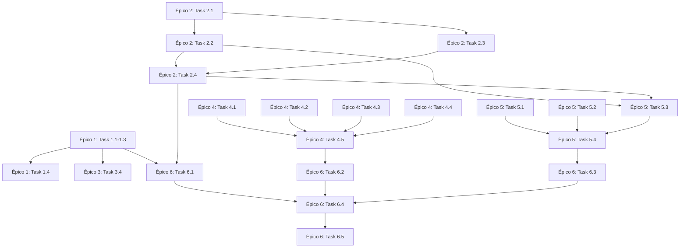

# Plano de Implementação - Landing Page iVebSystem

## 1. Visão Geral

Este documento transforma a arquitetura definida em um plano técnico executável, ordenado e detalhado, com tasks pequenas e objetivas, dependências claras e Definition of Done (DoD) para cada item.

### Status do Projeto

**Já Implementado:**
- ✅ Estrutura base (React Router v7, TypeScript, TailwindCSS)
- ✅ HeroSection
- ✅ ProblemSection
- ✅ SolutionSection
- ✅ HowItWorksSection
- ✅ ComparisonSection
- ✅ ExclusivitySection
- ✅ FAQSection
- ✅ FinalCTASection
- ✅ ContactFormSection (com redirecionamento WhatsApp)
- ✅ LandingFooter
- ✅ Header com navegação
- ✅ MobileMenu

**A Implementar:**
- ⚠️ BenefitsSection (US-04)
- ⚠️ ServicesSection (US-05)
- ⚠️ AboutSection (US-07)
- ⚠️ Melhorias de validação de formulário
- ⚠️ SEO completo (meta tags, Open Graph, Schema.org)
- ⚠️ Otimizações de performance
- ⚠️ Acessibilidade (WCAG AA)
- ⚠️ Testes e validações

---

## 2. Épicos

### Épico 1: Componentes de Conteúdo Faltantes
**Objetivo:** Implementar seções de conteúdo que faltam conforme PRD (US-04, US-05, US-07)

**Prioridade:** Alta  
**Estimativa:** 3-5 dias

---

### Épico 2: Validação e Melhorias de Formulário
**Objetivo:** Implementar validação robusta (frontend + backend) e melhorar UX do formulário

**Prioridade:** Alta  
**Estimativa:** 2-3 dias

---

### Épico 3: SEO e Metadata
**Objetivo:** Implementar SEO completo (meta tags, Open Graph, Schema.org, sitemap)

**Prioridade:** Média  
**Estimativa:** 1-2 dias

---

### Épico 4: Performance e Otimizações
**Objetivo:** Otimizar performance para atingir Lighthouse Score > 80

**Prioridade:** Média  
**Estimativa:** 2-3 dias

---

### Épico 5: Acessibilidade
**Objetivo:** Garantir conformidade WCAG AA mínimo

**Prioridade:** Média  
**Estimativa:** 1-2 dias

---

### Épico 6: Testes e Validações Finais
**Objetivo:** Validar funcionalidades, performance e qualidade antes do deploy

**Prioridade:** Alta  
**Estimativa:** 2-3 dias

---

## 3. Plano Detalhado de Execução

### ÉPICO 1: Componentes de Conteúdo Faltantes

#### Task 1.1: Criar BenefitsSection Component
**Descrição:** Implementar seção de benefícios (US-04) destacando vantagens do modelo de negócio

**Subtasks:**
1. Criar arquivo `app/components/landing/benefits-section.tsx`
2. Definir estrutura do componente seguindo padrão existente
3. Criar conteúdo dos benefícios:
   - Sem alto investimento inicial
   - Pagamento parcelado
   - Garantia de entrega
   - Parceria contínua
   - Extensão e comercialização do projeto
4. Adicionar ícones/visuals para cada benefício
5. Implementar design responsivo (mobile-first)
6. Adicionar animações sutis (se aplicável)
7. Exportar componente em `app/components/index.ts`
8. Importar e adicionar na rota `app/routes/landing.tsx`

**Dependências:** Nenhuma

**Ordem:** 1 (primeira task do épico)

**DoD:**
- [ ] Componente criado e funcionando
- [ ] Conteúdo alinhado com PRD (US-04)
- [ ] Design responsivo testado (mobile, tablet, desktop)
- [ ] Ícones/visuals implementados
- [ ] Integrado na landing page
- [ ] Sem erros de TypeScript
- [ ] Sem erros de lint

**Estimativa:** 4-6 horas

---

#### Task 1.2: Criar ServicesSection Component
**Descrição:** Implementar seção de serviços (US-05) listando tipos de soluções oferecidas

**Subtasks:**
1. Criar arquivo `app/components/landing/services-section.tsx`
2. Definir estrutura do componente seguindo padrão existente
3. Definir lista de serviços:
   - Sistemas web personalizados
   - Aplicativos mobile
   - Automação de processos
   - Integrações de sistemas
   - Consultoria tecnológica
   - (Outros conforme necessário)
4. Criar cards ou lista visual para cada serviço
5. Adicionar descrição breve de cada serviço
6. Implementar design responsivo (mobile-first)
7. Adicionar animações sutis (se aplicável)
8. Exportar componente em `app/components/index.ts`
9. Importar e adicionar na rota `app/routes/landing.tsx`

**Dependências:** Nenhuma

**Ordem:** 2

**DoD:**
- [ ] Componente criado e funcionando
- [ ] Conteúdo alinhado com PRD (US-05)
- [ ] Pelo menos 4-6 serviços listados
- [ ] Design responsivo testado (mobile, tablet, desktop)
- [ ] Integrado na landing page
- [ ] Sem erros de TypeScript
- [ ] Sem erros de lint

**Estimativa:** 4-6 horas

---

#### Task 1.3: Criar AboutSection Component
**Descrição:** Implementar seção "Sobre" (US-07) com informações da empresa/fundador

**Subtasks:**
1. Criar arquivo `app/components/landing/about-section.tsx`
2. Definir estrutura do componente seguindo padrão existente
3. Coletar/definir conteúdo:
   - História da empresa (breve)
   - Missão/visão
   - Informações do fundador (opcional)
   - Valores da empresa
4. Implementar layout visual atrativo
5. Adicionar foto/imagem (se disponível)
6. Implementar design responsivo (mobile-first)
7. Adicionar animações sutis (se aplicável)
8. Exportar componente em `app/components/index.ts`
9. Importar e adicionar na rota `app/routes/landing.tsx`

**Dependências:** Nenhuma (mas requer conteúdo do stakeholder)

**Ordem:** 3

**DoD:**
- [ ] Componente criado e funcionando
- [ ] Conteúdo alinhado com PRD (US-07)
- [ ] Design responsivo testado (mobile, tablet, desktop)
- [ ] Integrado na landing page
- [ ] Sem erros de TypeScript
- [ ] Sem erros de lint

**Estimativa:** 3-4 horas

---

#### Task 1.4: Ajustar Ordem e Navegação das Seções
**Descrição:** Reorganizar ordem das seções na landing page conforme fluxo ideal

**Subtasks:**
1. Revisar ordem atual das seções
2. Definir ordem ideal:
   - Hero
   - Problem
   - Solution
   - Benefits (nova)
   - Services (nova)
   - How It Works
   - About (nova)
   - Comparison (se mantiver)
   - Exclusivity
   - FAQ
   - Final CTA
   - Contact Form
   - Footer
3. Reordenar componentes em `app/routes/landing.tsx`
4. Atualizar navegação do header (se necessário)
5. Atualizar links de scroll/anchor
6. Testar fluxo de navegação

**Dependências:** Tasks 1.1, 1.2, 1.3 (componentes criados)

**Ordem:** 4

**DoD:**
- [ ] Ordem das seções definida e implementada
- [ ] Navegação do header atualizada (se necessário)
- [ ] Links de scroll funcionando corretamente
- [ ] Fluxo de navegação testado
- [ ] Sem erros de TypeScript
- [ ] Sem erros de lint

**Estimativa:** 1-2 horas

---

### ÉPICO 2: Validação e Melhorias de Formulário

#### Task 2.1: Criar Utilitários de Validação
**Descrição:** Criar funções utilitárias para validação de formulário reutilizáveis

**Subtasks:**
1. Criar arquivo `app/utils/validation.ts`
2. Implementar função `isValidEmail(email: string): boolean`
3. Implementar função `isValidPhone(phone: string): boolean` (formato brasileiro)
4. Implementar função `sanitizeInput(input: string): string` (remover caracteres perigosos)
5. Implementar função `validateFormData(data: FormData): { valid: boolean; errors: Record<string, string> }`
6. Adicionar testes unitários básicos (opcional, mas recomendado)
7. Exportar funções

**Dependências:** Nenhuma

**Ordem:** 1 (primeira task do épico)

**DoD:**
- [ ] Arquivo criado com todas as funções
- [ ] Funções testadas manualmente
- [ ] TypeScript types corretos
- [ ] Sem erros de lint
- [ ] Documentação inline (JSDoc)

**Estimativa:** 2-3 horas

---

#### Task 2.2: Implementar Validação Frontend no Formulário
**Descrição:** Adicionar validação em tempo real no componente de formulário

**Subtasks:**
1. Abrir `app/components/landing/contact-form-section.tsx`
2. Importar funções de validação de `app/utils/validation.ts`
3. Adicionar estado para erros de validação
4. Implementar validação em tempo real:
   - Email: ao perder foco (onBlur)
   - Telefone: ao perder foco (onBlur)
   - Nome: ao perder foco (onBlur)
5. Adicionar atributos HTML5 de validação:
   - `required` nos campos obrigatórios
   - `type="email"` no campo email
   - `pattern` no campo telefone (se aplicável)
6. Exibir mensagens de erro abaixo de cada campo
7. Desabilitar botão de submit se formulário inválido
8. Adicionar feedback visual (bordas vermelhas, ícones)
9. Testar validação em diferentes cenários

**Dependências:** Task 2.1 (utilitários de validação)

**Ordem:** 2

**DoD:**
- [ ] Validação frontend implementada
- [ ] Mensagens de erro exibidas corretamente
- [ ] Feedback visual funcionando
- [ ] Botão desabilitado quando inválido
- [ ] Testado em mobile e desktop
- [ ] Sem erros de TypeScript
- [ ] Sem erros de lint

**Estimativa:** 3-4 horas

---

#### Task 2.3: Melhorar Validação Backend na Action
**Descrição:** Aprimorar validação server-side na route action

**Subtasks:**
1. Abrir `app/routes/landing.tsx`
2. Importar funções de validação de `app/utils/validation.ts`
3. Melhorar validação na função `action`:
   - Validar email com `isValidEmail()`
   - Validar telefone com `isValidPhone()`
   - Sanitizar todos os inputs com `sanitizeInput()`
   - Validar comprimento mínimo/máximo dos campos
4. Retornar erros específicos por campo
5. Melhorar mensagens de erro (mais descritivas)
6. Adicionar logging de erros (opcional, para debug)
7. Testar validação com dados inválidos

**Dependências:** Task 2.1 (utilitários de validação)

**Ordem:** 3

**DoD:**
- [ ] Validação backend implementada
- [ ] Todos os campos validados
- [ ] Sanitização de inputs implementada
- [ ] Mensagens de erro específicas
- [ ] Testado com dados inválidos
- [ ] Sem erros de TypeScript
- [ ] Sem erros de lint

**Estimativa:** 2-3 horas

---

#### Task 2.4: Melhorar UX do Formulário
**Descrição:** Adicionar melhorias de UX (loading states, feedback, acessibilidade)

**Subtasks:**
1. Adicionar estado de loading durante submit
2. Desabilitar formulário durante submit (prevenir duplo submit)
3. Adicionar indicador visual de loading no botão
4. Melhorar mensagens de sucesso/erro
5. Adicionar `aria-label` e `aria-describedby` nos campos
6. Adicionar `aria-live` para mensagens de erro
7. Melhorar contraste de cores (acessibilidade)
8. Adicionar foco visível nos campos (outline)
9. Testar navegação por teclado

**Dependências:** Tasks 2.2, 2.3 (validação implementada)

**Ordem:** 4

**DoD:**
- [ ] Loading state implementado
- [ ] Prevenção de duplo submit
- [ ] Acessibilidade melhorada (ARIA)
- [ ] Navegação por teclado testada
- [ ] Contraste de cores adequado
- [ ] Testado em diferentes navegadores
- [ ] Sem erros de TypeScript
- [ ] Sem erros de lint

**Estimativa:** 2-3 horas

---

### ÉPICO 3: SEO e Metadata

#### Task 3.1: Completar Meta Tags na Rota
**Descrição:** Adicionar todas as meta tags necessárias (title, description, Open Graph, Twitter)

**Subtasks:**
1. Abrir `app/routes/landing.tsx`
2. Expandir função `meta()` com:
   - Title otimizado
   - Description otimizada (150-160 caracteres)
   - Keywords (se aplicável)
   - Open Graph tags:
     - og:title
     - og:description
     - og:type (website)
     - og:url
     - og:image (se houver)
   - Twitter Card tags:
     - twitter:card (summary_large_image)
     - twitter:title
     - twitter:description
     - twitter:image (se houver)
3. Adicionar canonical URL
4. Testar meta tags com ferramenta de preview (Facebook, Twitter)

**Dependências:** Nenhuma

**Ordem:** 1 (primeira task do épico)

**DoD:**
- [ ] Todas as meta tags implementadas
- [ ] Title e description otimizados
- [ ] Open Graph tags completas
- [ ] Twitter Card tags completas
- [ ] Testado com preview tools
- [ ] Sem erros de TypeScript
- [ ] Sem erros de lint

**Estimativa:** 2-3 horas

---

#### Task 3.2: Implementar Schema.org (JSON-LD)
**Descrição:** Adicionar structured data (Schema.org) para rich snippets

**Subtasks:**
1. Criar componente ou função para gerar JSON-LD
2. Definir schema apropriado (Organization ou LocalBusiness)
3. Adicionar dados:
   - name (iVebSystem)
   - description
   - url
   - logo (se houver)
   - contactPoint (email, telefone)
   - sameAs (redes sociais, se houver)
4. Inserir JSON-LD no componente da landing page
5. Validar schema com Google Rich Results Test
6. Testar renderização

**Dependências:** Nenhuma

**Ordem:** 2

**DoD:**
- [ ] JSON-LD implementado
- [ ] Schema validado com Google Rich Results Test
- [ ] Dados completos e corretos
- [ ] Renderizado corretamente na página
- [ ] Sem erros de TypeScript
- [ ] Sem erros de lint

**Estimativa:** 2-3 horas

---

#### Task 3.3: Criar Sitemap.xml
**Descrição:** Gerar sitemap.xml para indexação

**Subtasks:**
1. Criar arquivo `public/sitemap.xml`
2. Adicionar URL principal (landing page)
3. Definir prioridade e frequência de atualização
4. Adicionar lastmod (data de modificação)
5. Testar formato XML (validação)
6. Configurar para ser servido em `/sitemap.xml`

**Dependências:** Nenhuma

**Ordem:** 3

**DoD:**
- [ ] Sitemap.xml criado
- [ ] Formato XML válido
- [ ] Acessível em `/sitemap.xml`
- [ ] Validado com ferramenta de sitemap

**Estimativa:** 1 hora

---

#### Task 3.4: Otimizar Estrutura Semântica HTML
**Descrição:** Garantir que HTML use elementos semânticos corretos para SEO

**Subtasks:**
1. Revisar todos os componentes de seção
2. Garantir uso de `<header>`, `<main>`, `<section>`, `<nav>`, `<footer>`
3. Adicionar headings hierárquicos (`<h1>`, `<h2>`, `<h3>`) corretos
4. Garantir que há apenas um `<h1>` por página
5. Adicionar `alt` text em todas as imagens
6. Verificar estrutura com validador HTML

**Dependências:** Tasks 1.1, 1.2, 1.3 (componentes criados)

**Ordem:** 4

**DoD:**
- [ ] Estrutura semântica correta
- [ ] Headings hierárquicos corretos
- [ ] Apenas um `<h1>` na página
- [ ] Todas as imagens com `alt` text
- [ ] Validado com validador HTML
- [ ] Sem erros de TypeScript
- [ ] Sem erros de lint

**Estimativa:** 2-3 horas

---

### ÉPICO 4: Performance e Otimizações

#### Task 4.1: Otimizar Imagens
**Descrição:** Implementar otimização de imagens (WebP, lazy loading, compressão)

**Subtasks:**
1. Identificar todas as imagens usadas na landing page
2. Converter imagens para WebP (manter fallback)
3. Comprimir imagens (reduzir tamanho sem perder qualidade significativa)
4. Implementar lazy loading em imagens abaixo do fold
5. Adicionar `loading="lazy"` nas imagens não críticas
6. Adicionar `width` e `height` para evitar layout shift
7. Testar performance com Lighthouse

**Dependências:** Nenhuma

**Ordem:** 1 (primeira task do épico)

**DoD:**
- [ ] Imagens convertidas para WebP (com fallback)
- [ ] Imagens comprimidas
- [ ] Lazy loading implementado
- [ ] Layout shift minimizado
- [ ] Performance melhorada (verificar Lighthouse)
- [ ] Sem erros de TypeScript
- [ ] Sem erros de lint

**Estimativa:** 3-4 horas

---

#### Task 4.2: Otimizar Fontes
**Descrição:** Otimizar carregamento de fontes para melhor performance

**Subtasks:**
1. Revisar fontes usadas (atualmente Outfit do Google Fonts)
2. Adicionar `preconnect` para Google Fonts (já existe no root.tsx)
3. Adicionar `font-display: swap` no CSS
4. Considerar usar fontes do sistema como fallback
5. Verificar se há fontes não utilizadas
6. Testar performance de carregamento de fontes

**Dependências:** Nenhuma

**Ordem:** 2

**DoD:**
- [ ] Preconnect configurado
- [ ] Font-display: swap implementado
- [ ] Fallback de fontes do sistema
- [ ] Performance de fontes otimizada
- [ ] Testado com Lighthouse

**Estimativa:** 1-2 horas

---

#### Task 4.3: Implementar Code Splitting
**Descrição:** Garantir que code splitting está funcionando corretamente

**Subtasks:**
1. Verificar se React Router já faz code splitting automático
2. Testar se cada rota gera chunk separado
3. Verificar tamanho dos chunks (não devem ser muito grandes)
4. Considerar lazy loading de componentes pesados (se necessário)
5. Testar performance com DevTools (Network tab)

**Dependências:** Nenhuma

**Ordem:** 3

**DoD:**
- [ ] Code splitting funcionando
- [ ] Chunks de tamanho adequado
- [ ] Performance verificada
- [ ] Documentado (se houver configurações especiais)

**Estimativa:** 1-2 horas

---

#### Task 4.4: Otimizar CSS (Tailwind Purging)
**Descrição:** Garantir que Tailwind está removendo CSS não utilizado

**Subtasks:**
1. Verificar configuração do Tailwind (purging/content)
2. Testar build de produção
3. Verificar tamanho do CSS final
4. Garantir que apenas classes usadas estão no CSS final
5. Testar se não há classes faltando em produção

**Dependências:** Nenhuma

**Ordem:** 4

**DoD:**
- [ ] Tailwind purging configurado corretamente
- [ ] CSS de produção otimizado
- [ ] Tamanho do CSS verificado
- [ ] Testado em produção (build)

**Estimativa:** 1 hora

---

#### Task 4.5: Teste de Performance Completo
**Descrição:** Executar testes de performance e otimizar para Lighthouse Score > 80

**Subtasks:**
1. Executar Lighthouse no modo anônimo
2. Verificar Core Web Vitals:
   - LCP (Largest Contentful Paint) < 2.5s
   - FID (First Input Delay) < 100ms
   - CLS (Cumulative Layout Shift) < 0.1
3. Identificar oportunidades de melhoria
4. Implementar melhorias identificadas
5. Re-executar Lighthouse até atingir score > 80
6. Documentar métricas finais

**Dependências:** Tasks 4.1, 4.2, 4.3, 4.4 (otimizações anteriores)

**Ordem:** 5

**DoD:**
- [ ] Lighthouse Score > 80
- [ ] Core Web Vitals dentro dos limites
- [ ] Performance testada em mobile e desktop
- [ ] Métricas documentadas
- [ ] Sem regressões

**Estimativa:** 3-4 horas

---

### ÉPICO 5: Acessibilidade

#### Task 5.1: Revisar Contraste de Cores
**Descrição:** Garantir contraste mínimo WCAG AA (4.5:1 para texto normal)

**Subtasks:**
1. Identificar todas as combinações de cor texto/fundo
2. Testar contraste com ferramenta (WebAIM Contrast Checker)
3. Ajustar cores que não atendem ao mínimo
4. Testar em diferentes temas (se houver)
5. Documentar cores usadas

**Dependências:** Nenhuma

**Ordem:** 1 (primeira task do épico)

**DoD:**
- [ ] Todas as combinações de cor testadas
- [ ] Contraste mínimo de 4.5:1 garantido
- [ ] Cores ajustadas se necessário
- [ ] Testado com ferramenta de contraste
- [ ] Documentado

**Estimativa:** 2-3 horas

---

#### Task 5.2: Implementar Navegação por Teclado
**Descrição:** Garantir que toda a página é navegável apenas com teclado

**Subtasks:**
1. Testar navegação por teclado (Tab, Shift+Tab, Enter, Space)
2. Verificar se todos os elementos interativos são acessíveis
3. Garantir ordem lógica de foco
4. Adicionar `tabIndex` onde necessário
5. Adicionar `skip to content` link (opcional, mas recomendado)
6. Testar com screen reader (opcional, mas recomendado)

**Dependências:** Nenhuma

**Ordem:** 2

**DoD:**
- [ ] Navegação por teclado funcionando
- [ ] Ordem de foco lógica
- [ ] Todos os elementos interativos acessíveis
- [ ] Testado manualmente
- [ ] Sem erros de acessibilidade

**Estimativa:** 2-3 horas

---

#### Task 5.3: Adicionar ARIA Labels e Roles
**Descrição:** Adicionar atributos ARIA onde necessário para acessibilidade

**Subtasks:**
1. Revisar componentes para elementos sem texto descritivo
2. Adicionar `aria-label` em ícones e botões sem texto
3. Adicionar `aria-describedby` em campos de formulário
4. Adicionar `aria-live` em mensagens dinâmicas
5. Adicionar `role` onde necessário (landmarks)
6. Testar com screen reader (se possível)

**Dependências:** Tasks 2.2, 2.4 (formulário melhorado)

**Ordem:** 3

**DoD:**
- [ ] ARIA labels adicionados onde necessário
- [ ] Roles corretos
- [ ] Formulário acessível
- [ ] Testado (manualmente ou com screen reader)
- [ ] Sem erros de acessibilidade

**Estimativa:** 2-3 horas

---

#### Task 5.4: Validação de Acessibilidade Completa
**Descrição:** Executar validação completa de acessibilidade

**Subtasks:**
1. Executar axe DevTools (ou similar)
2. Corrigir problemas identificados
3. Testar com diferentes ferramentas (WAVE, Lighthouse Accessibility)
4. Validar conformidade WCAG AA
5. Documentar resultados

**Dependências:** Tasks 5.1, 5.2, 5.3 (todas as melhorias de acessibilidade)

**Ordem:** 4

**DoD:**
- [ ] Validação executada
- [ ] Problemas corrigidos
- [ ] Conformidade WCAG AA verificada
- [ ] Documentado

**Estimativa:** 2-3 horas

---

### ÉPICO 6: Testes e Validações Finais

#### Task 6.1: Testes Funcionais
**Descrição:** Testar todas as funcionalidades da landing page

**Subtasks:**
1. Testar navegação (header, links, scroll)
2. Testar formulário de contato:
   - Validação frontend
   - Validação backend
   - Redirecionamento para WhatsApp
   - Mensagens de erro
3. Testar responsividade em diferentes dispositivos
4. Testar em diferentes navegadores (Chrome, Firefox, Safari, Edge)
5. Testar mobile menu
6. Documentar bugs encontrados e corrigir

**Dependências:** Todos os épicos anteriores

**Ordem:** 1 (primeira task do épico)

**DoD:**
- [ ] Todas as funcionalidades testadas
- [ ] Bugs documentados e corrigidos
- [ ] Testado em múltiplos navegadores
- [ ] Testado em múltiplos dispositivos
- [ ] Checklist de testes completo

**Estimativa:** 4-6 horas

---

#### Task 6.2: Testes de Performance
**Descrição:** Validar performance final e Core Web Vitals

**Subtasks:**
1. Executar Lighthouse em modo anônimo
2. Verificar Core Web Vitals
3. Testar em conexão lenta (3G throttling)
4. Testar em diferentes dispositivos (mobile, tablet, desktop)
5. Verificar tempo de carregamento < 3s
6. Documentar métricas finais

**Dependências:** Épico 4 (Performance)

**Ordem:** 2

**DoD:**
- [ ] Lighthouse Score > 80
- [ ] Core Web Vitals dentro dos limites
- [ ] Tempo de carregamento < 3s
- [ ] Testado em diferentes condições
- [ ] Métricas documentadas

**Estimativa:** 2-3 horas

---

#### Task 6.3: Testes de Acessibilidade
**Descrição:** Validação final de acessibilidade

**Subtasks:**
1. Executar ferramentas de acessibilidade (axe, WAVE, Lighthouse)
2. Testar navegação por teclado
3. Verificar contraste de cores
4. Testar com screen reader (se possível)
5. Corrigir problemas encontrados
6. Documentar conformidade WCAG AA

**Dependências:** Épico 5 (Acessibilidade)

**Ordem:** 3

**DoD:**
- [ ] Validação completa executada
- [ ] Problemas corrigidos
- [ ] Conformidade WCAG AA verificada
- [ ] Documentado

**Estimativa:** 2-3 horas

---

#### Task 6.4: Revisão de Código e Qualidade
**Descrição:** Revisar código, qualidade e documentação

**Subtasks:**
1. Executar linter (verificar erros)
2. Executar typecheck (TypeScript)
3. Revisar estrutura de arquivos
4. Verificar comentários e documentação
5. Revisar convenções de código
6. Corrigir problemas encontrados

**Dependências:** Todos os épicos anteriores

**Ordem:** 4

**DoD:**
- [ ] Sem erros de lint
- [ ] Sem erros de TypeScript
- [ ] Código revisado
- [ ] Documentação adequada
- [ ] Convenções seguidas

**Estimativa:** 2-3 horas

---

#### Task 6.5: Preparação para Deploy
**Descrição:** Preparar build de produção e documentação de deploy

**Subtasks:**
1. Executar build de produção (`npm run build`)
2. Verificar se build foi bem-sucedido
3. Testar build localmente (`npm run start`)
4. Verificar se todos os assets estão corretos
5. Documentar processo de deploy
6. Criar checklist de deploy
7. Preparar variáveis de ambiente (se necessário)

**Dependências:** Todos os épicos anteriores

**Ordem:** 5

**DoD:**
- [ ] Build de produção executado com sucesso
- [ ] Build testado localmente
- [ ] Documentação de deploy criada
- [ ] Checklist de deploy criado
- [ ] Pronto para deploy

**Estimativa:** 2-3 horas

---

## 4. Ordem de Execução Recomendada

### Fase 1: Conteúdo (Épico 1)
**Duração estimada:** 3-5 dias

1. Task 1.1: BenefitsSection
2. Task 1.2: ServicesSection
3. Task 1.3: AboutSection
4. Task 1.4: Ajustar ordem e navegação

**Justificativa:** Conteúdo é base da landing page. Deve ser implementado primeiro para ter visão completa.

---

### Fase 2: Formulário (Épico 2)
**Duração estimada:** 2-3 dias

1. Task 2.1: Utilitários de validação
2. Task 2.2: Validação frontend
3. Task 2.3: Validação backend
4. Task 2.4: Melhorias de UX

**Justificativa:** Formulário é funcionalidade crítica. Deve ser robusto e bem testado.

---

### Fase 3: SEO (Épico 3)
**Duração estimada:** 1-2 dias

1. Task 3.1: Meta tags
2. Task 3.2: Schema.org
3. Task 3.3: Sitemap.xml
4. Task 3.4: Estrutura semântica

**Justificativa:** SEO é importante para visibilidade. Pode ser feito em paralelo com outras fases.

---

### Fase 4: Performance (Épico 4)
**Duração estimada:** 2-3 dias

1. Task 4.1: Otimizar imagens
2. Task 4.2: Otimizar fontes
3. Task 4.3: Code splitting
4. Task 4.4: CSS purging
5. Task 4.5: Teste completo

**Justificativa:** Performance impacta experiência do usuário e SEO. Deve ser otimizada antes do deploy.

---

### Fase 5: Acessibilidade (Épico 5)
**Duração estimada:** 1-2 dias

1. Task 5.1: Contraste de cores
2. Task 5.2: Navegação por teclado
3. Task 5.3: ARIA labels
4. Task 5.4: Validação completa

**Justificativa:** Acessibilidade é requisito não funcional importante. Pode ser feito em paralelo com performance.

---

### Fase 6: Validações Finais (Épico 6)
**Duração estimada:** 2-3 dias

1. Task 6.1: Testes funcionais
2. Task 6.2: Testes de performance
3. Task 6.3: Testes de acessibilidade
4. Task 6.4: Revisão de código
5. Task 6.5: Preparação para deploy

**Justificativa:** Validações finais garantem qualidade antes do deploy.

---

## 5. Dependências entre Tasks

### Diagrama de Dependências

### Tasks que Podem Ser Feitas em Paralelo

- **Épico 1 (Tasks 1.1, 1.2, 1.3)**: Podem ser feitas em paralelo
- **Épico 3 (Tasks 3.1, 3.2, 3.3)**: Podem ser feitas em paralelo
- **Épico 4 (Tasks 4.1, 4.2, 4.3, 4.4)**: Podem ser feitas em paralelo (exceto 4.5)
- **Épico 5 (Tasks 5.1, 5.2, 5.3)**: Podem ser feitas em paralelo (exceto 5.4)

---

## 6. Definition of Done (DoD) Global

Uma task é considerada **DONE** quando:

1. ✅ **Código implementado** conforme especificação
2. ✅ **Testado manualmente** em pelo menos 2 navegadores
3. ✅ **Sem erros de TypeScript** (`npm run typecheck`)
4. ✅ **Sem erros de lint** (linter configurado)
5. ✅ **Responsivo** testado (mobile, tablet, desktop)
6. ✅ **Documentado** (comentários inline quando necessário)
7. ✅ **Revisado** (self-review ou pair review)
8. ✅ **Integrado** na aplicação (se aplicável)
9. ✅ **DoD específico da task** atendido

---

## 7. Riscos e Mitigações

### Risco 1: Conteúdo Não Disponível
**Probabilidade:** Média  
**Impacto:** Médio

**Mitigação:**
- Usar conteúdo placeholder profissional
- Documentar onde conteúdo precisa ser substituído
- Criar estrutura que facilite substituição futura

---

### Risco 2: Performance Não Atinge Meta
**Probabilidade:** Baixa  
**Impacto:** Alto

**Mitigação:**
- Otimizações incrementais
- Testes de performance contínuos
- Identificar e resolver gargalos cedo

---

### Risco 3: Bugs em Produção
**Probabilidade:** Baixa  
**Impacto:** Alto

**Mitigação:**
- Testes abrangentes (Épico 6)
- Revisão de código
- Testes em ambiente similar à produção

---

## 8. Estimativas Totais

### Por Épico

| Épico | Estimativa (dias) | Estimativa (horas) |
|-------|-------------------|---------------------|
| Épico 1: Componentes de Conteúdo | 3-5 dias | 24-40 horas |
| Épico 2: Validação de Formulário | 2-3 dias | 16-24 horas |
| Épico 3: SEO e Metadata | 1-2 dias | 8-16 horas |
| Épico 4: Performance | 2-3 dias | 16-24 horas |
| Épico 5: Acessibilidade | 1-2 dias | 8-16 horas |
| Épico 6: Testes e Validações | 2-3 dias | 16-24 horas |
| **TOTAL** | **11-18 dias** | **88-144 horas** |

### Considerações

- Estimativas assumem trabalho focado e sem bloqueios
- Podem variar conforme experiência do desenvolvedor
- Paralelização pode reduzir tempo total
- Dependências de conteúdo podem adicionar tempo

---

## 9. Checklist de Deploy

### Pré-Deploy

- [ ] Todos os épicos concluídos
- [ ] Todos os testes passando
- [ ] Build de produção executado com sucesso
- [ ] Build testado localmente
- [ ] Performance validada (Lighthouse > 80)
- [ ] Acessibilidade validada (WCAG AA)
- [ ] SEO implementado e validado
- [ ] Código revisado
- [ ] Documentação atualizada

### Deploy

- [ ] Variáveis de ambiente configuradas
- [ ] Domínio e HTTPS configurados
- [ ] Deploy executado
- [ ] Smoke tests em produção
- [ ] Verificação de meta tags em produção
- [ ] Verificação de formulário em produção

### Pós-Deploy

- [ ] Monitoramento configurado (se aplicável)
- [ ] Google Search Console configurado
- [ ] Analytics configurado (se aplicável)
- [ ] Documentação de rollback (se necessário)

---

## 10. Próximos Passos Imediatos

1. **Revisar este plano** com a equipe
2. **Priorizar épicos** conforme necessidade de negócio
3. **Definir responsáveis** para cada épico/task
4. **Iniciar Épico 1** (Componentes de Conteúdo)
5. **Configurar tracking** de progresso (board, issues, etc.)

---

**Versão:** 1.0  
**Data:** 2024  
**Autor:** Tech Lead  
**Status:** Pronto para Execução

